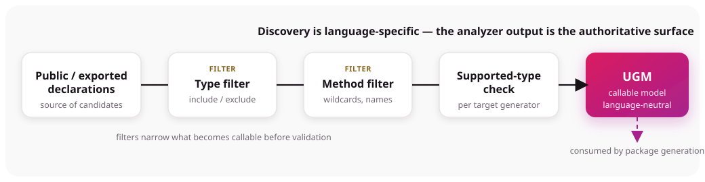

# Callable surface

The **callable surface** is the analyzer-selected set of declarations represented in the UGM. It is the input to package generation, not a promise that every target generator supports every represented type.

Discovery is language-specific. A declaration that is public in source is not necessarily discovered,
and a discovered declaration is not necessarily portable to every consumer language.

## .NET and CLR

The analyzer starts with exported, visible, top-level assembly types. It records public declared
instance and static methods, public constructors, fields, properties, and public nested types.
Special-name and generated record methods are excluded. Type and method filters can narrow the
result.

Method filters support comma-separated `*` and `?` patterns against bare or fully qualified method names. Tests verify empty, bare, wildcard, qualified, and combined type/method filters.

## Node.js and TypeScript

Discovery begins with package runtime exports. The analyzer handles direct ESM exports, supported
default and CommonJS forms, and re-exports. Type-only exports, interfaces, type aliases, private
members, and `#` private names are skipped. Exported classes, functions, and constants can become
types, global methods, and global fields. Class constructors, methods, accessors, and properties are
modeled separately where supported.

Because export analysis has many syntax paths, use analyzer output—not the source file alone—as the authoritative surface.

## Java and JVM

The JVM analyzer scans top-level `.class` entries in the selected JAR. It excludes `module-info`,
synthetic methods, and `$`-named class entries from top-level discovery. Public constructors and
nested classes are represented.

Current implementation caveat: method discovery uses `getDeclaredMethods()` without a visibility
filter, so private and protected declared methods can enter the analyzed model. Fields and properties
are not currently modeled. Treat analyzer and Vision output as authoritative, and use method filters
to prevent unintended methods from entering the surface.

## Python

The Python analyzer imports files from the selected module tree. Classes and module-level functions
must be defined by the analyzed module; imported classes are excluded. Public module functions and
variables can become global members. For classes, explicit `__init__`, ordinary methods,
`@staticmethod` methods, public fields, and `@property` accessors are analyzed. Leading-underscore
and dunder names are generally excluded.

Import-based analysis can execute module initialization code. Keep provider imports deterministic
and free of unsafe startup side effects. When a type filter is active, Python global functions and
variables are not included.

## PHP

The PHP analyzer parses `.php` files and discovers classes, interfaces, traits, enums, and top-level
functions. Reflection then exposes public methods, constructors, constants, and properties.
Constructors, destructors, magic methods, and non-public members are excluded. A default public
zero-argument constructor can be inferred for eligible classes without an explicit constructor.

## Ruby

The Ruby analyzer statically parses `.rb` files with Ripper. Classes become callable types; modules
act as namespaces rather than top-level callable types. File-scope methods and selected globals can
be represented. Instance methods, class methods, `initialize`, constants, class variables, and
`attr_*` declarations contribute to the model.

Dynamic methods created through `define_method`, `method_missing`, or other runtime metaprogramming
are not discovered by static analysis. The current handler also does not consistently remove methods
marked private or protected, so verify and filter the generated surface.

## Perl

Gateway contains Perl runtime-hosting hooks, but this repository has no Perl module analyzer or
generated-client pipeline equivalent to the six analyzers above. Do not assume a Perl provider can
produce a UGM or Graft package from the current implementation.

See [Language support status](../language-guides/support-status.md).

## Cross-language summary

- All six analyzers support type and method filtering, but filter names and matching rules differ.
- .NET and PHP are primarily visibility-based.
- Node.js is export-based.
- Python combines module ownership with naming conventions and runtime import.
- Java reflection and Ruby static analysis currently require extra review because non-public methods
  may enter the analyzed model.
- Discovery is only the first gate; type mapping, package generation, installation, and runtime
  invocation must also succeed for the chosen provider-consumer pair.

## A practical rule

Expose only declarations intended for consumers, then verify:

1. the analyzer includes the intended members;
2. package generation succeeds for the target ecosystem;
3. the generated package has the expected names and types;
4. a runtime smoke test reaches the intended implementation.

See [Public surface vs implementation](public-interface-vs-business-logic.md) and [Type mapping](type-mapping.md).

## Evidence

Verified against the analyzer implementations and tests under:

- `graftcode-module-analyzer/src/netcore`
- `graftcode-module-analyzer/src/nodejs`
- `graftcode-module-analyzer/src/jvm`
- `graftcode-module-analyzer/src/python`
- `graftcode-module-analyzer/src/php`
- `graftcode-module-analyzer/src/ruby`

No `graftcode-module-analyzer/src/perl` implementation was found.
