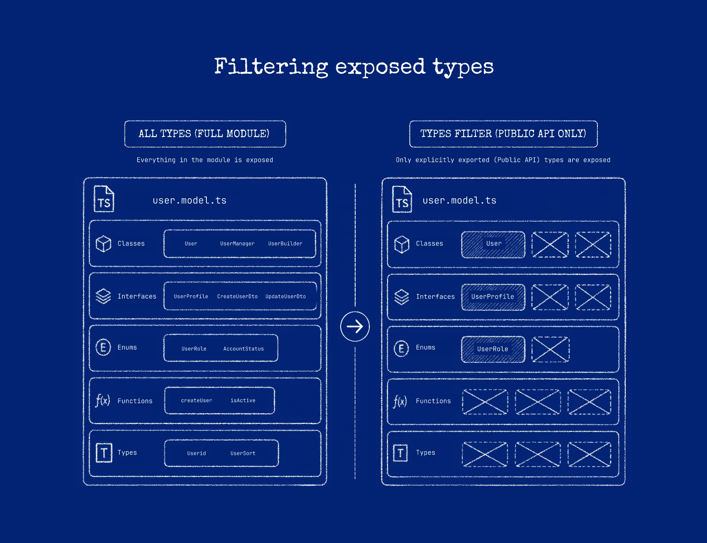

# Callable surface

The **callable surface** is the set of public types and methods intentionally exposed through Gateway. It is the input to Graft generation, not a promise that every target ecosystem supports every exposed type.

## Design it intentionally

The callable surface is a contract. Everything you expose becomes part of the generated Graft that Callers install and depend on, so treat it as a deliberate design decision rather than a side effect of what happens to be public.

- **Public code is not automatically exposed code.** Being public or exported in source makes a member *eligible*; type and method filters and the supported-type check decide what is actually exposed.
- **A member that is exposed on the Receiver is not guaranteed to be portable** to every Caller language. Discovery is only the first gate; type mapping, package generation, installation, and a runtime call must all succeed for the chosen Receiver–Caller pair.

## Verify in Vision

Always confirm the actual surface in [Graftcode Vision](graftcode-vision.md) rather than reasoning from source alone. Vision reflects exactly the types and methods the current Gateway exposes for the loaded module. Use it before you generate or publish a Graft.

## Control exposure with filters

Type and method filters are available for every supported runtime. Use them to expose only intentional operations and to keep implementation details off the contract. Filter syntax and matching rules differ per runtime — copy the exact form from the current Gateway/Vision output. See [Filter the callable surface](../how-to-guides/filter-callable-surface.md).

## Runtime-specific behavior to watch (current Alpha)

Discovery differs by language. The consequences that affect your contract:

- **.NET:** Public types and their public methods, constructors, fields, properties, and nested types are exposed. Compiler-generated members (for example record helpers) are not. This surface is close to what you expect from visibility, so filtering is mostly about scope, not safety.
- **Node.js / TypeScript:** Exposure is based on the package's runtime exports. Type-only constructs (interfaces, type aliases) and private members do not appear. Because there are many valid export styles, treat the surface shown in Vision — not the source file — as authoritative.
- **Java:** Discovery may include declared methods that are not intended for remote use, and fields are not currently exposed. Review the surface in Vision and use method filters to expose only intentional operations.
- **Python:** Only classes and functions defined by the analyzed module are exposed; imported symbols are not, and leading-underscore/dunder names are generally excluded. Importing the module can run module-level initialization, so keep Receiver imports deterministic and free of unsafe startup side effects.
- **PHP:** Public methods, constructors, constants, and properties of discovered classes, interfaces, traits, and enums are exposed; magic methods and non-public members are not.
- **Ruby:** Dynamically generated methods (for example via `define_method` or `method_missing`) may not appear in the callable surface, and non-public methods are not consistently excluded. Prefer explicit public methods for anything that must be exposed, and verify the result in Vision.
- **Perl:** Gateway can host Perl code, but there is no current Graft-generation path for a Perl Receiver. Do not plan to publish a Graft from a Perl Receiver today. See [Supported runtimes and package managers](../reference/supported-runtimes-package-managers.md).

## Security implications

The callable surface is an exposure boundary, not an authorization boundary. Filtering keeps unintended methods off the contract, but it does not authenticate or authorize a caller. Combine intentional surface design with invocation authentication and authorization — see [Authentication and authorization](../operations/authentication-authorization.md).

## A practical rule

Expose only declarations intended for Callers, then verify:

1. Vision shows the intended members and nothing else;
2. package generation succeeds for the target ecosystem;
3. the generated package has the expected names and types;
4. a runtime smoke test reaches the intended Receiver code.

See [Public surface vs implementation](public-interface-vs-business-logic.md) and [Type mapping](type-mapping.md).
