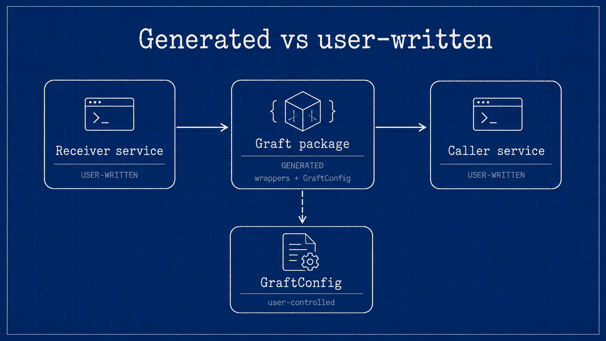

# Caller and receiver

In Graftcode, **Caller** and **Receiver** name the two **services** in an integration:

- the **Caller** is the **calling service** — your application that needs to invoke behavior elsewhere;
- the **Receiver** is the **called service** — your module whose public methods are the contract.

Both sides are **user-written**. You own the service business logic on each side. Graftcode does not generate your domain code, database access, or deployment. It removes the **integration layer** you would otherwise maintain between those services — HTTP clients, route handlers, hand-designed DTOs, and custom SDKs.

## What you write vs what is generated

| | Caller (calling service) | Between the services | Receiver (called service) |
| --- | --- | --- | --- |
| **You write** | Application or service business logic; when to call; retries, auth policy, and operational handling | — | Module or class library with an intentional public surface |
| **Generated for you** | — | **Graft** — typed package that mirrors the Receiver's callable surface | — |
| **Operated / hosted** | Your runtime and deployment | Hypertube inside the Graft; Gateway when configured for remote execution | Your module, loaded in-process or hosted by Gateway |

The Graft is the only integration artifact the Caller installs. It is produced from the Receiver's **public interface**, not from your private implementation.

## Caller — the calling service

The Caller is **your service** that:

- decides *when* and *with what arguments* to invoke the Receiver;
- installs the generated Graft from Vision or the public registry;
- sets `GraftConfig` (for example `host` and `stateless`) before the first call;
- handles latency, failures, retries, and authorization appropriate to the deployment.

At the call site your code looks like a normal method invocation on generated types. Under that surface, the Graft initializes Hypertube, serializes the command, and routes it to the configured execution path — in-memory or through Gateway. You do not hand-write that plumbing.

## Receiver — the called service

The Receiver is **your module** — typically a plain class library or package — whose supported public methods form the [callable surface](callable-surface.md).

You write the implementation. Gateway **hosts** the module for remote execution (or the same module loads in-process for in-memory mode). Callers never receive your source code; they receive a Graft generated from the public surface.

Keep transport types, ORM models, secrets, and framework handles off the public surface. See [Public surface vs implementation](public-surface-vs-implementation.md).

## Integration layers Graftcode replaces

Without Graftcode, connecting two services usually means designing and maintaining integration code on at least one side:

| Hand-written integration | With Graftcode |
| --- | --- |
| REST or OpenAPI client, URLs, and HTTP verbs | Generated Graft method call |
| Request and response DTOs separate from domain models | Types derived from the Receiver surface |
| Custom SDK or fetch wrapper per consumer language | Package manager install from Vision or registry |
| Different client code for local vs remote | Same call site; `GraftConfig` selects execution mode |

Graftcode **cuts out** that middle layer. The Caller service stays focused on business logic; the Graft carries the contract.

When some clients must stay on REST, see [Use Graftcode alongside an existing REST API](../how-to-guides/use-graftcode-alongside-an-existing-rest-api.md).

## One service, two roles

Caller and Receiver describe **one invocation direction**, not fixed product roles. The same codebase can:

- act as a **Receiver** when it exposes a module through Gateway;
- act as a **Caller** when it installs another team's Graft.

A modular monolith can host multiple Receivers in one process while one component Calls another through an in-memory Graft — still the same Caller / Receiver / Graft model.

## Under the hood

For readers who need runtime detail:

**Caller side (inside the Graft):** resolve configuration, obtain a runtime context, build a command for the target member, deserialize the result or surface an error.

**Receiver side:** accept the command on the enabled execution path, dispatch to the hosted member, return the serialized response.

Remote execution still crosses a process or network boundary. "Looks like a method call" does not mean local failure semantics — plan for timeouts, partial failures, and version skew like any distributed call.

## Continue

- [What is a Graft?](what-is-a-graft.md) — generated package details
- [How Graftcode works](../introduction/how-graftcode-works.md) — full diagram and mental model
- [Expose code as a Graftcode Receiver](../how-to-guides/expose-code-as-a-graftcode-receiver.md) — shape the called service
- [Obtain and install a Graft](../how-to-guides/obtain-and-install-a-graft.md) — wire the calling service
- [Use Graftcode alongside an existing REST API](../how-to-guides/use-graftcode-alongside-an-existing-rest-api.md) — keep REST while adding Grafts
