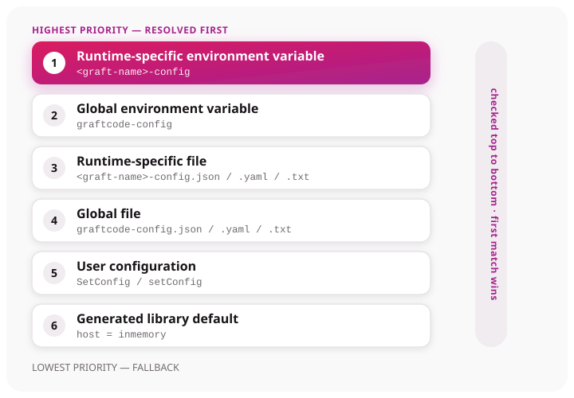

# Configuration resolution

Generated Grafts include `GraftConfig` (or an equivalent configuration type). On first initialization,
it loads known sources, registers a package default, and asks Hypertube for the named configuration.
Field naming and helper APIs differ by runtime—copy them from Vision.

## Priority order



Graftcode resolves configuration in this order (highest priority first):

1. runtime-specific environment variable;
2. global environment variable;
3. runtime-specific file;
4. global file;
5. user configuration supplied through `SetConfig`/`setConfig`;
6. generated library default.

This order means environment and file sources override a programmatic user configuration. At the same name and priority, the first added configuration wins.

## Generated source names

Generated templates attempt:

- `<graft-name>-config` environment variable;
- `graftcode-config` environment variable;
- `<graft-name>-config.json`, `.yaml`, or `.txt`;
- `graftcode-config.json`, `.yaml`, or `.txt`.

Relative file paths resolve from the application's current working directory. The generated default uses the package's graft name, runtime, module, `Host`/`host` (default `inmemory`), and `Stateless`/`stateless`.

## Accepted content

The resolver accepts JSON, YAML, or semicolon-delimited connection-string data. JSON and YAML use a top-level `configurations` object. A connection string requires at least `name` and `runtime`; normal generated defaults also specify `modules`, `host`, and `stateless`.

## Initialization timing

`GraftConfig` caches its runtime context. Change static configuration fields or add sources before the first generated call. Generated packages do not expose a supported reset/re-resolve operation.

## Remote host example

```multi
```dotnet
GraftConfig.Host = "ws://localhost/ws";
GraftConfig.Stateless = true;
```
```javascript
GraftConfig.host = "ws://localhost/ws";
GraftConfig.stateless = true;
```
```python
GraftConfig.host = "ws://localhost/ws"
GraftConfig.stateless = True
```
```java
GraftConfig.host = "ws://localhost/ws";
GraftConfig.stateless = true;
```
```php
GraftConfig::$host = 'ws://localhost/ws';
GraftConfig::$stateless = true;
```
```ruby
GraftConfig.host = "ws://localhost/ws"
GraftConfig.stateless = true
```
```

Copy imports, property casing, and helper names from the installed package or Vision.

.NET and Node.js are fully covered; other generated runtimes follow the same conceptual model — confirm behavior in the installed package.
