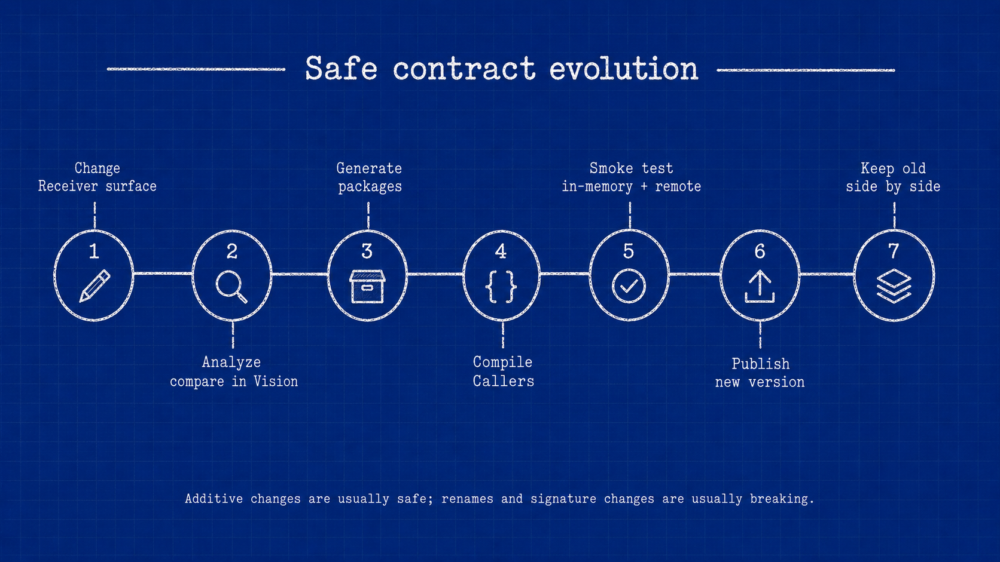

# Contract evolution

A Graft contract is the exposed callable surface plus its type information. Changing that surface can require a new generated package and Caller changes.

## Usually additive

Examples include adding a new type or method without changing existing generated names or signatures. “Additive” does not guarantee compatibility in every target ecosystem: overload resolution, name casing, package exports, and type generation can still change.

## Usually breaking

- removing or renaming a type or member;
- changing parameter order, count, or mapped type;
- changing a return type;
- changing static to instance or instance to static;
- removing or changing a constructor used by Callers;
- changing nullability where the target generator represents it;
- introducing a type unsupported by a target generator.

## Safe workflow

1. Change the Receiver surface deliberately.
2. Re-host the module with Gateway and compare the resulting callable surface in Vision.
3. Generate packages for every supported caller ecosystem.
4. Compile/type-check representative Callers.
5. Run in-memory and remote smoke tests as applicable.
6. Publish a new version according to the package ecosystem's compatibility policy.
7. Keep the old hosted contract available while old Callers still depend on it, when the deployment supports side-by-side versions.

## Compatibility caveats

Graftcode tracks module and package versions, but does not guarantee automatic rejection when a changed callable surface is published under the same version. Do not rely on automatic contract-drift prevention; verify it in your deployment.

Not every additive source change is guaranteed to be binary- or source-compatible in every generated target.
