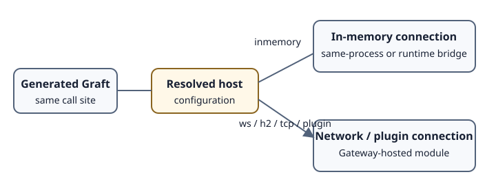

# In-memory, same-machine, and remote execution

## In memory

`host=inmemory` or `host=in-memory` creates in-memory connection data. For .NET, a command with this connection type dispatches directly to the receiver; other runtime combinations may go through the native transmitter to load or bridge a runtime.

Do not describe all in-memory calls as zero-copy, zero-serialization, or equivalent to a direct CLR/JavaScript call. The command path still constructs and serializes runtime commands.

## Same machine

“Local” can mean a Gateway on `localhost`, another process on the same machine, or in-memory execution. These are different:

- `ws://localhost/...` is still WebSocket network transport;
- `tcp://localhost:port` is still TCP;
- `inmemory` selects in-memory connection data.

Use the precise term in architecture and troubleshooting documentation.

## Remote

Remote configuration points at another process or machine. Current resolvers recognize WebSocket (`ws://`, `wss://`), HTTP/2 (HTTP(S) host values ending in `h2`), TCP (`tcp://host:port` or `host:port`), and plugin connection data.

Remote execution adds transport availability, latency, authentication, routing, and partial-failure concerns. Generated typing does not remove those concerns.

## Same package, different configuration

Generated Graft templates default `Host`/`host` to `inmemory`, and runtime-specific or global configuration can select another path. Whether a specific generated package contains the hosted module needed for in-memory execution is package- and ecosystem-dependent; verify the installed package contents and smoke test.
