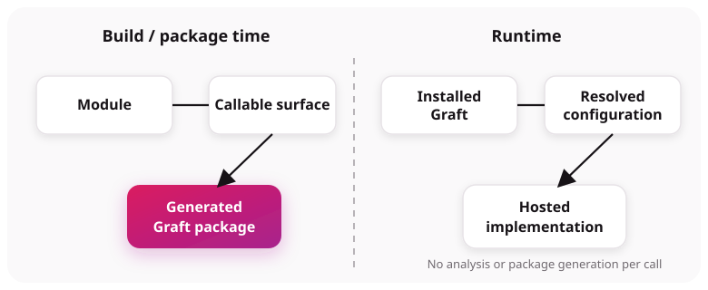

# Gateway and hosted modules

**Graftcode Gateway (`gg`)** is the host process for one or more modules. It selects or detects a runtime, loads the configured modules, exposes runtime-call transports, and can serve Graftcode Vision.

## Selecting modules and runtimes

Pass the built module as the first positional argument (`gg ./path/to/module.dll`). If no path is supplied, Gateway scans the current directory and attempts runtime detection. Use `--runtime` only when auto-detection is wrong.

“Hosted module” means a module loaded for execution by this process. It does not mean the generated Graft package.

## Ports and transports

The current Gateway README documents these defaults:

- WebSocket service calls: port `80`;
- Vision HTTP UI: port `81`;
- optional TCP server: port `82`;
- optional HTTP/2 server: port `83`.

TCP and HTTP/2 require their enabling flags. Defaults are operational defaults, not part of a module contract, and deployments can override them.

## Analysis and registration

The module analyzer creates a UGM from the selected callable surface. The service-model uploader accepts UGM data, and package-generation components later consume stored UGM data. Keep these build/package activities distinct from runtime invocation: a normal method call uses the installed Graft and resolved runtime connection; it does not regenerate the package.

## What the Gateway is not

It is not the generated Graft and it is not the user module. It does expose network listeners, so describing it as “not in the traffic path” would be inaccurate for remote calls.

## Evidence and uncertainty

Verified against `graftcode-gateway/README.md`, the module analyzers, `graftcode-service-model-uploader`, and package-generation engine.

The inspected implementation does not establish that only interface metadata ever leaves the environment under every Gateway option or plugin. Treat data-egress behavior as deployment- and plugin-specific until separately audited.
