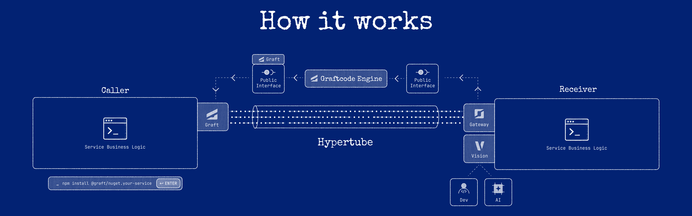

# Hypertube runtime bridge

**Hypertube** is the runtime communication bridge between an installed [Graft](what-is-a-graft.md) and [Gateway](gateway-and-hosted-modules.md). When your Caller invokes a generated method, Hypertube carries that call to the Receiver and brings the result back.



## Where it sits

```text
Caller → Graft → Hypertube → Gateway → Receiver
```

The generated Graft exposes methods that look like local calls. Hypertube is the layer beneath those methods that connects to Gateway, transfers the invocation, and returns the response to your code.

## Execution modes

Hypertube uses the [runtime host](../reference/project-key-registry-host-and-credentials.md) from resolved configuration to decide how a call executes:

- **In-memory** — the Receiver runs in the same process; no network hop.
- **Network transports** — WebSocket (default), and optionally TCP or HTTP/2, reach a Gateway over the network.

You select the mode by configuring the runtime host, not by changing business code. See [Execution modes](in-memory-same-machine-and-remote-execution.md) and [Ports and protocols](../reference/ports-and-protocols-reference.md).

## Connection setup

For a network host, Hypertube establishes a connection to Gateway on first use and reuses it for subsequent calls. Copy the exact host string (including scheme and path) from Vision; do not hand-construct routes.

## What still applies (distributed-system properties)

A remote Graft call looks like a local method call, but it is a remote call. The following remain true and must be handled by your application and deployment:

- **Latency** — a network hop is not free.
- **Serialization** — arguments and results are represented and transferred; only supported types cross the boundary (see [Type mapping](type-mapping.md)).
- **Partial failure** — the connection or Receiver can fail independently of the Caller.
- **Timeouts and retries** — apply them in Caller code and infrastructure (see [Timeouts and retries](../operations/timeouts-and-retries.md)).
- **Security** — encrypt the transport and authenticate/authorize invocations (see [Authentication and authorization](../operations/authentication-and-authorization-operations.md)).

## How failures surface

When a call cannot complete — the Receiver is unavailable, the transport drops, or the Receiver raises an error — the failure surfaces to the Caller through the generated call (as an exception or error result, by runtime). Treat remote calls as fallible and handle errors explicitly. See [Handle Receiver errors](../how-to-guides/handle-receiver-errors.md).

## What Hypertube does not guarantee

- It does **not** make remote and in-memory calls behaviorally identical; network calls have latency and failure modes that in-memory calls do not.
- It does **not** provide cross-runtime cancellation, distributed transactions, or automatic idempotency.
- Transports do **not** all have identical failure or header semantics; choose the transport deliberately.

There is no published, versioned public wire specification you should depend on; treat the transfer format as an internal detail and rely on the generated Graft's method contract instead.

See [Invocation lifecycle](invocation-lifecycle.md) for the end-to-end sequence.
