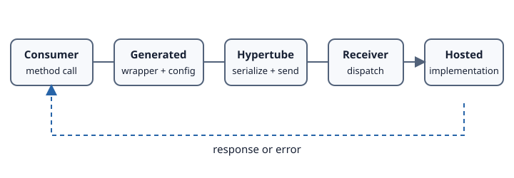

# Hypertube runtime bridge

**Hypertube** is the runtime layer used by generated Grafts. The inspected SDK turns generated wrapper operations into commands, serializes them, selects an execution path from resolved connection data, and deserializes the response.

## Execution paths in the current implementation

The .NET interpreter has explicit branches for:

- WebSocket connection data;
- HTTP/2 connection data;
- in-memory .NET execution through the receiver;
- other configured connections through the native transmitter, including TCP and plugins.

The configuration parser recognizes `inmemory`/`in-memory`, `ws://`, `wss://`, HTTP(S) URLs ending in `h2`, `tcp://host:port`, and bare `host:port`.

## Commands and responses

At runtime, the caller-side interpreter:

1. optionally wraps the command for registered plugins;
2. serializes it;
3. sends it through the selected path;
4. deserializes the response;
5. returns the response to generated code.

The receiver-side interpreter deserializes an incoming command, dispatches it to a handler, and produces a response.

## What is not established here

The inspected code clearly uses serialized command models, but these pages do not claim a stable public wire specification named “IIP”; that name and compatibility guarantee were not established by the inspected tests. Likewise, no general performance comparison with REST or gRPC is asserted without benchmark scope and results.

## Evidence

Verified against `HYPERTUBE/src/netcore/Hypertube.Netcore.Core/Interpreters/Interpreter.cs`, `Transmitter/Transmitter.cs`, and SDK configuration resolvers. See [Invocation lifecycle](invocation-lifecycle.md) for the end-to-end sequence.
