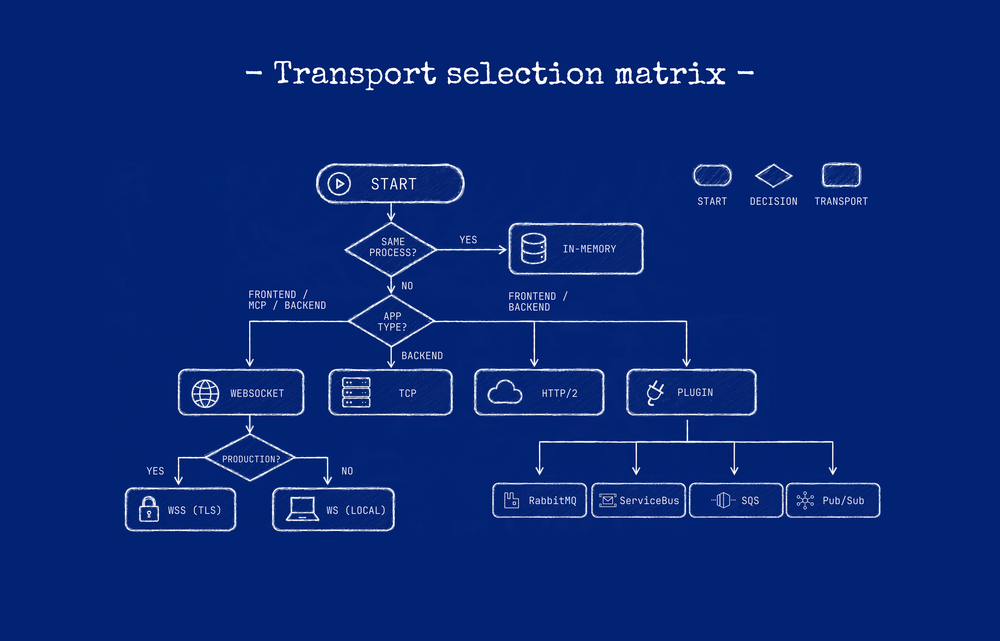
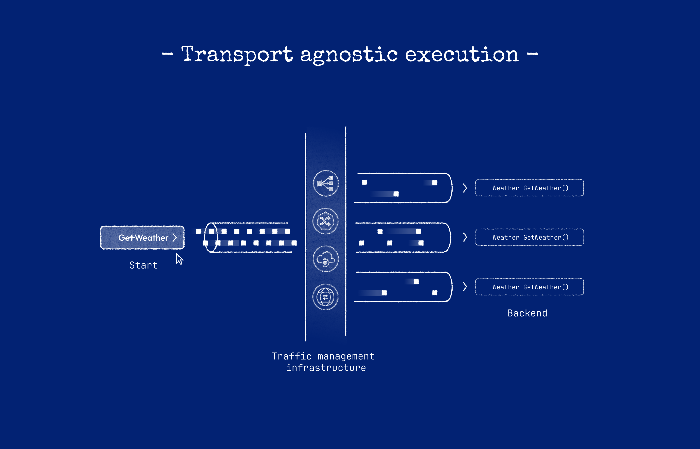

# In-memory, same-machine, and remote execution

**Execution mode** is where the Receiver runs relative to your Caller. The generated Graft and your
call site stay the same — [Hypertube](hypertube-runtime-bridge.md) reads the resolved `host` from
[GraftConfig](configuration-resolution.md) and dispatches each invocation in memory, over a
localhost listener, or to a remote Gateway.

This page defines three terms that are often conflated in conversation and logs: **in memory**,
**same machine**, and **remote**. Use them precisely in architecture and troubleshooting
documentation. To change mode, set `host` before the first generated call — see
[Configure Graft invocation](../how-to-guides/configure-graft-invocation.md). For host formats and
Gateway listeners, see [Ports and protocols](../reference/ports-and-protocols-reference.md).

## In memory

`host=inmemory` or `host=in-memory` runs the Receiver in the same process, without a network hop.

Do not describe in-memory calls as zero-copy, zero-serialization, or equivalent to a direct language-level call. Arguments and results are still represented and transferred.

## Same machine

“Local” can mean a Gateway on `localhost`, another process on the same machine, or in-memory execution. These are different:

- `ws://localhost/...` is still WebSocket network transport;
- `tcp://localhost:port` is still TCP;
- `inmemory` selects in-memory connection data.

Use the precise term in architecture and troubleshooting documentation.

## Remote

Remote configuration points at another process or machine. Current resolvers recognize WebSocket (`ws://`, `wss://`), HTTP/2 (HTTP(S) host values ending in `h2`), TCP (`tcp://host:port` or `host:port`), and plugin connection data.

Remote execution adds transport availability, latency, authentication, routing, and partial-failure concerns. Generated typing does not remove those concerns.

## Same package, different configuration

Generated Graft templates default `Host`/`host` to `inmemory`, and runtime-specific or global configuration can select another path. Whether a specific generated package contains the hosted module needed for in-memory execution is package- and ecosystem-dependent; verify the installed package contents and smoke test.
