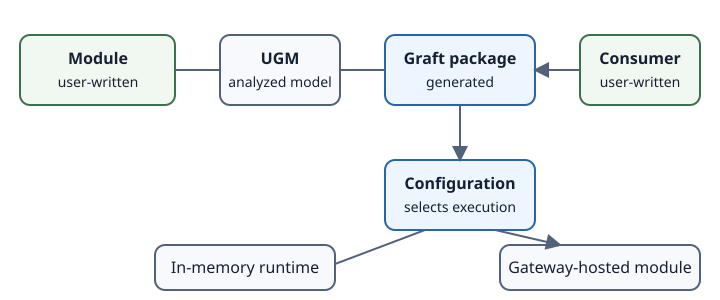

# Core concepts

Read these pages in order:

1. [What is a Graft?](what-is-a-graft.md)
2. [Core-concepts glossary](glossary.md)
3. [Callable surface](callable-surface.md)
4. [Public surface vs implementation](public-interface-vs-business-logic.md)
5. [Package generation](package-generation.md)
6. [Gateway and hosted modules](graftcode-gateway.md)
7. [Configuration resolution](configuration-resolution.md)
8. [In-memory, same-machine, and remote execution](execution-modes.md)
9. [Static and instance context](static-and-instance-context.md)
10. [Invocation lifecycle](invocation-lifecycle.md)
11. [Hypertube runtime bridge](hypertube-runtime-bridge.md)
12. [Caller and receiver](caller-and-receiver.md)
13. [Type mapping](type-mapping.md)
14. [Contract evolution](contract-evolution.md)
15. [Graftcode Vision](graftcode-vision.md)

These pages separate analyzer/package-time behavior from runtime behavior and identify evidence gaps rather than presenting unverified behavior as a guarantee.
