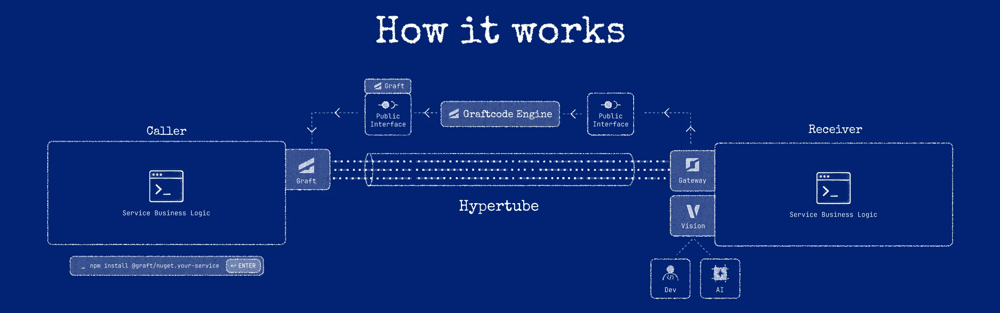

# Invocation lifecycle

1. **Application code calls a generated member.** Static and instance members use different generated handlers.
2. **The generated `GraftConfig` initializes once.** It loads known environment and file sources, registers the generated default, and initializes a named runtime context.
3. **Configuration resolution selects connection data.** The winning source determines in-memory, WebSocket, HTTP/2, TCP, or plugin behavior.
4. **Generated code builds an operation.** Instance operations carry the generated instance context; static operations target the type directly.
5. **Hypertube represents the call for transfer.**
6. **The selected execution mode carries it.** In-memory execution runs the Receiver in the same process; network modes send the call over the configured transport.
7. **The Receiver handles the call.**
8. **The result is returned and converted back to the Caller's types.**

## Failure points

Failures can occur before execution (missing package or invalid configuration), during connection/transport, during dispatch, in user implementation code, or while mapping a response. Remote calls therefore require normal distributed-systems handling even though the call site resembles ordinary code.

## Async, cancellation, and timeouts

Keep these four things distinct:

- **Receiver internals** can use async code freely — it is an implementation detail behind the public
  method.
- **The public method contract** must use portable shapes. For .NET, public methods must be
  **synchronous**: `Task`/`Task<T>` and cancellation tokens are not accepted on the public surface.
  Other runtimes vary; use the simplest supported return type for a cross-runtime contract.
- **The generated Caller API** may be synchronous or asynchronous by runtime. For example, a generated
  Node.js/TypeScript call can return `Promise<T>` (you `await` it) even when the .NET Receiver method
  is synchronous. Follow the exact call shape in the installed package and Vision.
- **Cancellation and timeouts** are a Caller/deployment concern. There is no built-in cross-runtime
  cancellation; apply timeouts, retries, and cancellation in Caller code and infrastructure. See
  [Timeouts and retries](../operations/timeouts-retries.md).

## What does not happen per call

The module is not re-analyzed and the Graft package is not regenerated during an ordinary invocation. Those belong to the package/build path.
