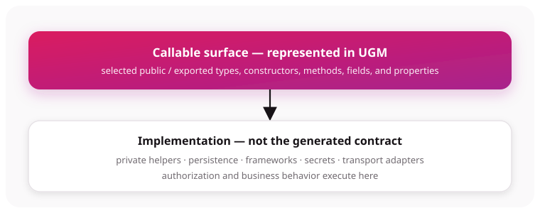

# Public surface vs implementation

The **callable surface** is the part of a module intentionally exposed through Gateway and therefore available for generated Grafts. The **implementation** is everything that executes behind that surface.

## What analysis includes

The Graftcode Engine defines the boundary differently per runtime:

- **.NET/CLR:** exported visible types and their public declared members;
- **Node.js/TypeScript:** runtime exports and supported re-exports, excluding type-only and private declarations;
- **Java/JVM:** top-level JAR classes and declared methods, with public constructors and no field model;
- **Python:** module-owned classes, public module functions/variables, and conventionally public class members;
- **PHP:** parsed classes, interfaces, traits, enums, global functions, and reflected public members;
- **Ruby:** statically parsed classes, methods, constructors, attributes, constants, and selected globals.

Java and Ruby currently require particular care because discovery can include declared
methods that are not public in source. Python analysis imports Receiver modules, while Ruby analysis
does not discover runtime metaprogramming. See [Callable surface](callable-surface.md) for the exact
rules and caveats.

## Keep internals behind the boundary

Helpers, persistence code, transport adapters, secrets, and framework objects should remain non-public or non-exported. A small surface:

- reduces the model that Callers depend on;
- makes generated packages easier to understand;
- limits type-mapping failures;
- makes contract changes easier to classify.

This is a design rule, not a security boundary by itself. Authorization still belongs in the hosted implementation and deployment configuration.

## Public does not mean supported

Discovery and package generation are separate checks. For example, the Graftcode Engine can describe public members whose signatures later fail package generation. Package generation explicitly rejects unsupported framework complex types such as `System.DateTime`.

Use [Type mapping](type-mapping.md) before publishing a contract.

The exact hosted surface can also be narrowed by Gateway `--types` and method filters.
