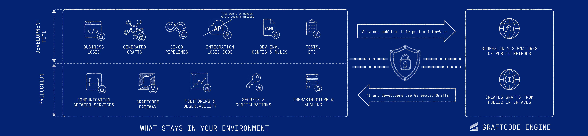

# Public surface vs implementation

Graftcode separates **what you expose** — the public programming interface — from **how you implement it** — business logic, infrastructure, secrets, and runtime data. The diagram below is the mental model for that split.

Read the figure left to right:

- **Left — what stays in your environment:** development and production artifacts you control. Padlocks mark categories that must not be sent to Graftcode Engine as part of contract publication.
- **Center — the publication boundary:** services publish their **public interface** outward; developers and AI use **generated Grafts** inward.
- **Right — Graftcode Engine:** stores signatures of public methods and creates Grafts from those interfaces. It is not in the normal runtime invocation path.

## What stays in your environment

### Development time

| Artifact | Stays local because |
| --- | --- |
| **Business logic** | Method bodies, algorithms, and domain rules execute only in your Receiver. They are not part of UGM publication. |
| **Generated Grafts** | Caller packages are generated from the public surface and installed in your projects. They are not a copy of your Receiver source. |
| **CI/CD pipelines** | Build, test, and release automation remain in your toolchain. |
| **Integration logic** | Adapters, orchestration, and glue behind the public surface are implementation details. |
| **Dev config and rules** | Local settings, feature flags, and lint rules are not callable contract metadata. |
| **Tests** | Verification of private behavior stays in your repository. |

Keep integration and business logic behind non-public or non-exported members. **Only the intentional public surface is published** — not everything marked `public` in source by accident.

### Production

| Artifact | Stays local because |
| --- | --- |
| **Communication between services** | Runtime arguments and results travel Caller → Gateway → Receiver. They do not pass through Graftcode Engine during normal invocation. |
| **Graftcode Gateway** | Hosts Receiver modules and exposes transports in your deployment. |
| **Monitoring and observability** | Metrics, logs, and traces are emitted from components you instrument and configure. |
| **Secrets and configurations** | Keys, connection strings, and environment-specific values remain in your secret stores and config systems. |
| **Infrastructure and scaling** | VMs, containers, load balancers, and orchestration are your operational boundary. |

See [Gateway and hosted modules](gateway-and-hosted-modules.md#data-boundary) for a category-by-category table of destinations and runtime paths.

## What Graftcode Engine receives

Graftcode Engine has two jobs visible in the diagram:

1. **Store signatures of public methods** — type names, method names, parameter types, return types, and related metadata used to build the Unified Graft Model (UGM).
2. **Create Grafts from public interfaces** — on-demand generation of typed Caller packages for the requested ecosystem.

The Engine does **not** receive:

- method bodies or source files;
- private, internal, or filtered-out members;
- runtime argument values or return payloads;
- database content, secrets, or customer data;
- framework handles, streams, or other implementation types you keep off the public surface.

Publication can still reveal **names** in the callable surface you expose. Design that surface deliberately — see [Callable surface](callable-surface.md).

## Public surface vs implementation in code

| | Public surface | Implementation |
| --- | --- | --- |
| **Definition** | Types and methods intentionally exposed through Gateway | Everything that executes behind those methods |
| **Who sees it** | Graftcode Engine (for UGM), Vision (for review), Callers (via generated Grafts) | Your Receiver process only |
| **Typical contents** | Small synchronous methods, primitive or plain-model parameters and returns | Persistence, HTTP clients, ORM, secrets, framework adapters |
| **Design goal** | Stable, portable contract across Caller languages | Freedom to refactor without breaking consumers |

Helpers, transport adapters, and framework objects belong in implementation. A small surface:

- reduces what Callers depend on;
- makes generated packages easier to understand;
- limits type-mapping failures;
- makes contract changes easier to classify.

This is a **contract and exposure** rule, not an authorization boundary by itself. Validate callers in Receiver methods and deployment configuration — see [Authentication and authorization operations](../operations/authentication-and-authorization-operations.md).

## How analysis draws the line

The Graftcode Engine defines the boundary differently per runtime. Examples:

- **.NET:** exported visible types and their public declared members;
- **Node.js/TypeScript:** runtime exports and supported re-exports, excluding type-only and private declarations;
- **Java:** top-level JAR classes and declared methods (review carefully — not every declared method is intended for remote use);
- **Python:** module-owned classes and public functions; imported symbols and dunder names are generally excluded;
- **PHP:** reflected public members of discovered classes, interfaces, traits, and enums;
- **Ruby:** statically parsed classes and methods; dynamic metaprogramming may not appear.

Java and Ruby require particular care because discovery can include members you did not intend to expose. Python analysis imports Receiver modules; Ruby does not discover runtime metaprogramming. See [Callable surface](callable-surface.md) for exact rules, filters, and Vision verification.

## Public does not mean supported

Discovery and package generation are separate checks. The Engine can describe a public member whose signature later fails package generation — for example when unsupported framework complex types appear on the surface.

Use [Type mapping](type-mapping.md) before publishing. Narrow the hosted surface with Gateway `--types` and method filters when needed — see [Filter the callable surface](../how-to-guides/filter-the-callable-surface.md).

## Practical checklist

Before you publish or share a Receiver surface:

1. **Vision** shows only the members you intend to expose.
2. **Package generation** succeeds for every target Caller ecosystem.
3. **No secrets or implementation types** appear on the public surface.
4. **Business logic** remains in private or non-exported code paths.
5. A **runtime smoke test** reaches the intended Receiver method through an installed Graft.

## Next steps

- [Callable surface](callable-surface.md) — how Gateway selects exposed members
- [Expose code as a Graftcode Receiver](../how-to-guides/expose-code-as-a-graftcode-receiver.md) — shape a small public contract
- [Type mapping](type-mapping.md) — verify cross-language portability
- [Gateway and hosted modules](gateway-and-hosted-modules.md) — where Gateway fits in your environment
