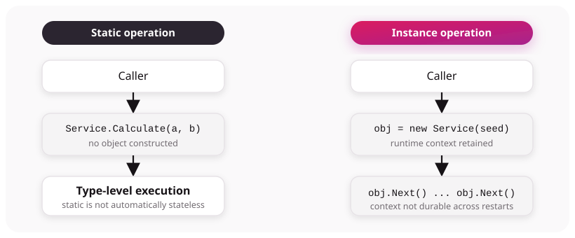

# Static and instance context

The callable surface and generated Grafts distinguish **static** operations from **instance** operations.

## Static operations

A static method belongs to the type. The Graftcode Engine records it as a static operation, and generated wrappers invoke it without first constructing an object.

Static does not automatically mean stateless. A static implementation can still read or mutate process state. `stateless` is also a separate configuration value in generated `GraftConfig`.

## Instance operations

Public constructors are represented separately, and instance methods are represented as `INSTANCE_METHOD`. Generated instance wrappers retain runtime object context used by subsequent operations.

This distinction is visible in Vision and in the generated static/instance calls.

## Lifetime and routing caveat

Constructors and instance operations are generated and carry context. There is no universal object-lifetime guarantee across Gateway restarts, reconnects, retries, all transports, or all language pairs.

Treat an instance Graft as bound to runtime context. Do not persist it as a durable identifier unless a specific runtime and version documents and tests that behavior.

## Choosing a shape

- Prefer static methods when the operation naturally depends only on supplied inputs and shared services.
- Prefer instances when constructor inputs and a sequence of operations are part of the domain model.
- Keep durable identity in explicit domain IDs when it must survive process or connection lifetime.

See [Contract evolution](contract-evolution.md) before changing between static and instance forms; it changes generated Caller code.
