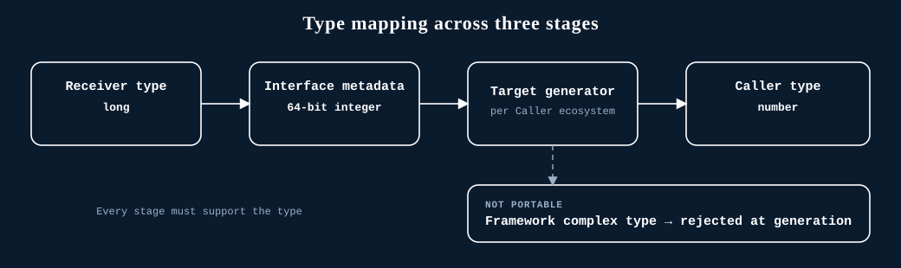

# Type mapping

Type mapping occurs as the Graftcode Engine analyzes the provider, builds the UGM, and generates the target package. Support is a property of that complete path—not just the source language.

## Detailed mappings by target language

For generated TypeScript/JSDoc, current primitive mappings include:

- string and char → `string`;
- numeric primitive categories → `number`;
- boolean → `boolean`;
- void → `void`;
- nullable values → a union with `null`;
- Graft model types → generated class names.

For generated .NET, current mappings include:

- string → `string`;
- integer and unsigned integer → `int`;
- boolean → `bool`;
- float → `float`;
- byte → `byte`;
- char → `char`;
- long and unsigned long-long → `long`;
- double → `double`;
- nullable supported value types → `?`;
- Graft model types → generated or known local types.

Unknown values can degrade to `unknown` in TypeScript or `object` in .NET, except where an unresolved local class is recognized.

## Portable baselines for all generated consumers

Graftcode also supports Java/JVM, Python, PHP, and Ruby, with cross-runtime smoke coverage. Their
conservative public-contract baselines are:

- **Java/JVM:** `String`, primitive numbers, `boolean`, plain Java objects, and homogeneous arrays.
- **Python:** `str`, `int`, `float`, `bool`, simply typed classes, and homogeneous `list[T]` values.
- **PHP:** `string`, `int`, `float`, `bool`, typed plain classes, and homogeneous sequential arrays.
- **Ruby:** `String`, `Integer`, `Float`, booleans, small value objects, and homogeneous `Array` values.

These are interoperability baselines, not exhaustive mappings. Boxed and nullable values, unions,
enums, records, generics, maps, framework collections, date/time classes, arbitrary object values,
and inheritance require verification for the exact provider-consumer pair.

Consumer-side asynchronous syntax also does not change the provider contract automatically. For
example, a generated Node.js call can return `Promise<T>` even when the .NET provider method must
remain synchronous.

## Language-specific references

- [.NET](../language-guides/dotnet.md#supported-types)
- [Node.js and TypeScript](../language-guides/nodejs-typescript.md#supported-types)
- [Java and JVM](../language-guides/java-jvm.md#supported-types)
- [Python](../language-guides/python.md#supported-types)
- [PHP](../language-guides/php.md#supported-types)
- [Ruby](../language-guides/ruby.md#supported-types)

Perl has no equivalent generated-client/type-mapping path. See
[Language support status](../language-guides/support-status.md#perl).

## Supported surface is stricter than discovery

The Graftcode Engine rejects framework complex types in public interfaces (`System.DateTime` is a typical example). Therefore, a type appearing in the discovered surface does not prove that package generation will accept it.

Use simple primitives and explicitly modeled public types. Prefer ISO-8601 strings and string identifiers for cross-language contracts unless the exact producer/consumer pair has generation and runtime tests for richer types.

## Collections, generics, callbacks, and nullability

Graftcode handles arrays, generics, delegates, nested types, and nullable metadata, but support varies by language pair. Verify each intended language pair with a generated-package smoke test.

This is not a complete compatibility matrix. Confirm richer types for the exact provider/consumer pair before relying on them.
