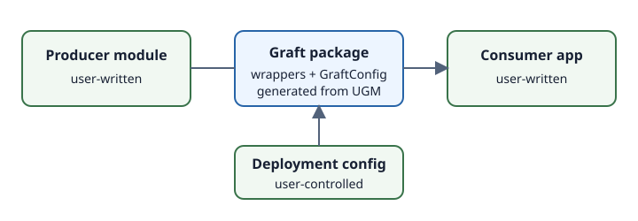
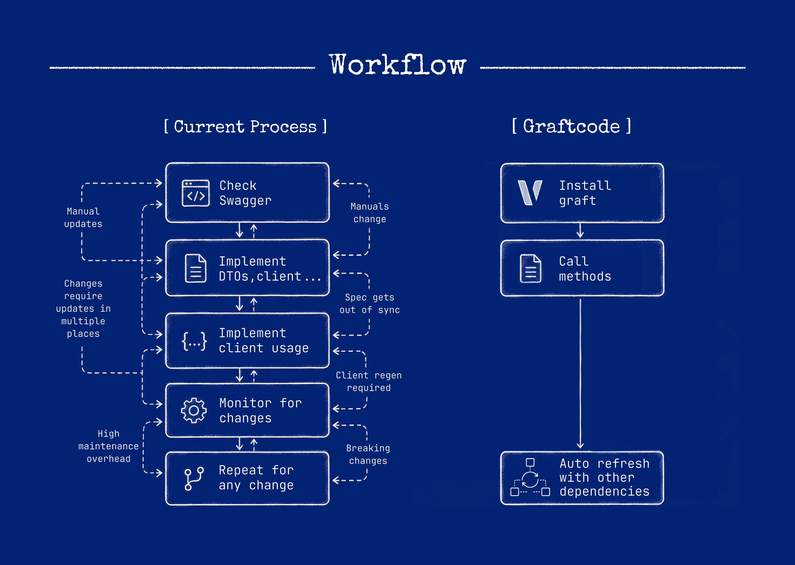

# What is a Graft?

A **Graft** is a generated package for calling a module through Graftcode. It presents types and members derived from the module's analyzed callable surface. Application code imports the package and uses generated classes and methods; the generated code initializes the Hypertube runtime bridge and sends the invocation to the configured execution context.

## The four parts

1. A Receiver writes a module.
2. Gateway captures the selected [callable surface](callable-surface.md).
3. The Graftcode Engine uses that callable-surface metadata to build a Graft for a target package ecosystem.
4. At runtime, the installed Graft resolves configuration and invokes the hosted or in-memory module.

The module implementation and the consuming application are user-written. The wrapper, configuration class, and invocation plumbing inside a Graft are generated.

## What a Graft is not

A Graft is not the hosted implementation, the Gateway, or a copy of the Receiver's code. It is also not a manually maintained HTTP SDK. Its shape is generated from the Receiver's callable surface, while its runtime behavior depends on resolved configuration.

## Build time and runtime

Package generation and invocation are separate:

- **Build/package time:** select the callable surface and generate a package.
- **Application build time:** restore the package and type-check or compile calls.
- **Runtime:** resolve the Graft configuration, initialize a runtime context, transport the command, execute the module, and return a result or error.

## Scope

This does **not** imply that every source-language type can be mapped to every target language; see [Type mapping](type-mapping.md).

Next: [Callable surface](callable-surface.md), [Package generation](package-generation.md), and [Invocation lifecycle](invocation-lifecycle.md).
