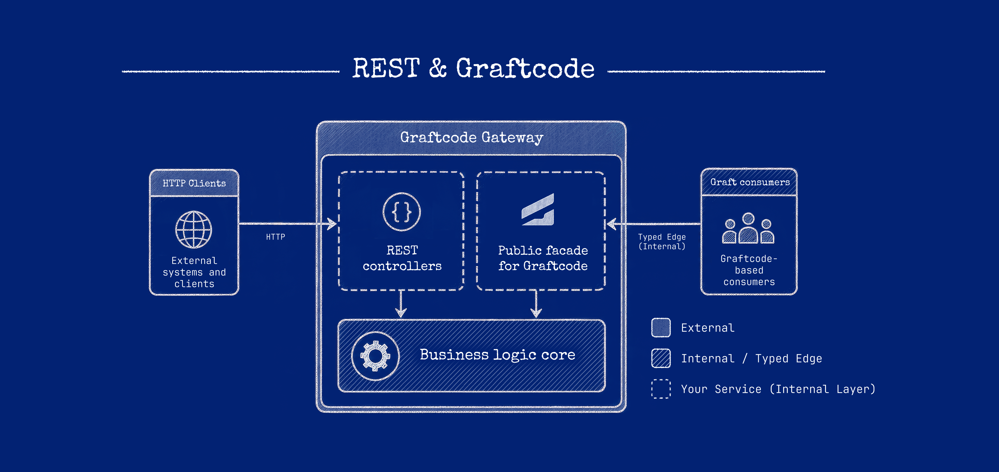
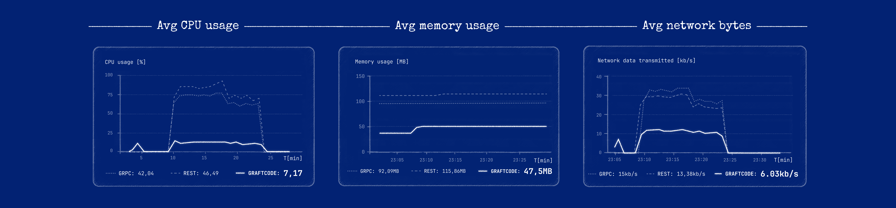

# Use Graftcode alongside an existing REST API

Graftcode and REST solve different integration problems. They can coexist in one product when each
boundary has a clear owner. You do **not** have to move every client to generated Grafts before you
adopt Graftcode.

## When to keep REST

Keep REST (or OpenAPI) when:

- external clients require a public HTTP contract;
- partners integrate via webhooks or fixed URLs;
- Callers cannot install a generated Graft.

See [When to use Graftcode](../introduction/choose-your-scenario.md).

## When to add Graftcode

Add Graftcode for **internal** or **controlled** callers that can install generated packages:

- service-to-service method calls across languages;
- sharing a Receiver library without hand-written HTTP clients;
- flipping between in-memory and remote execution with configuration alone.

## Typical layout

You do not need a big-bang migration. **Graftcode Gateway (`gg`)** can host existing HTTP/REST
workloads while also exposing a Graftcode Receiver surface from the same deployment. External clients
keep calling REST routes; controlled Callers install generated Grafts when you are ready.

```text
┌─────────────────────────────────────┐
│  Monolith or API host               │
│  ├─ REST controllers (public)       │
│  └─ Receiver module (Graftcode)     │──► Gateway ──► remote Callers
└─────────────────────────────────────┘
```

REST integration starts from manually designed resources, routes, HTTP verbs, and payloads.
Graftcode integration starts from an analyzed callable surface and a generated Graft. Both cross a
boundary; the difference is **who maintains the integration layer** and **which clients use which
path**.



### Steps

1. Extract callable business logic into a **plain module** (class library or package)—not controller
   types on the public Graft surface.
2. Keep REST controllers as thin adapters that call the same module internally if needed.
3. Host the module with Gateway for Graft Callers.
4. Do not expose database or HTTP framework types on the Graft contract.

### Host REST through Gateway

For a **published ASP.NET Web API** on the same host:

1. Publish the Web API to a folder (for example `dotnet publish`).
2. Set `ASPNETCORE_CONTENTROOT` to that publish folder and the other `ASPNETCORE_*` variables your app
   expects (application name, environment, hosting startup).
3. Start Gateway with `--runApp` so the Web API entry point runs and REST routes stay available.
4. Expose the plain business module as the Graftcode Receiver surface so Gateway can generate Grafts
   for controlled Callers.

REST requests and Graft invocations use separate paths on the same host. See
[Gateway CLI reference](../reference/gateway-cli-reference.md) for `--runApp`, ports, and runtime
options.

After installing a Graft from Vision, configure remote execution before the first call. See
[Configure invocation](configure-graft-invocation.md).

## How they compare



REST and gRPC keep a protocol contract (URLs/operations, schemas, and a client) separate from your
business code. With Graftcode the supported public method surface is the contract and the installed
Graft is the client. Neither is universally faster; the right choice depends on who owns the contract,
who the Callers are, and your interoperability, streaming, and browser needs.

Graftcode removes application-authored controllers, DTO mapping, transport clients, and serialization
code for controlled Callers. Its runtime still represents and transfers invocation data, so the
resulting performance depends on the runtime pair, execution mode, payload, transport, topology, and
workload. This documentation does not publish comparative performance numbers without a documented,
reproducible benchmark.

## Next steps

- [Expose code](expose-code-as-a-graftcode-receiver.md)
- [Caller and receiver](../core-concepts/caller-and-receiver.md)
- [Authentication operations](../operations/authentication-and-authorization-operations.md)
