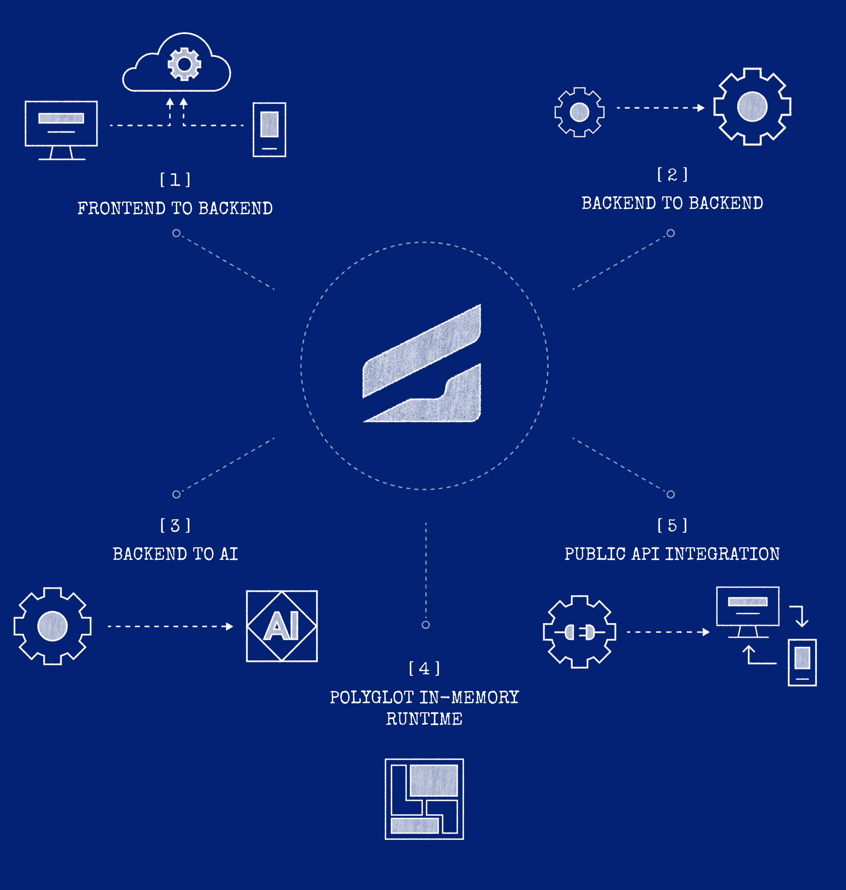

# Choose your scenario

Use this page to route from your goal to a [Quick start](https://docs.graftcode.com/quick-start)
course and the documentation that explains the design behind it. Graftcode is best suited to callable
behavior with an intentional programming interface; it is not a universal replacement for every
protocol or data movement pattern.

> **Hands-on first:** Quick start has step-by-step tutorials. Return here and to the reference pages when you need concepts, constraints, or operations detail. See the full course index in
> [Quick start courses](../reference/quick-start-courses.md).

## Start with your goal

Pick one of the five integration scenarios below, then open the matching section for runtime links
and concepts to read next.

1. **Frontend to backend** — browser, desktop, or mobile Caller → [Connect frontend to backend](https://docs.graftcode.com/quick-start/connect-frontend-to-backend)
2. **Backend to backend** — service-to-service → [Connect microservices](https://docs.graftcode.com/quick-start/connect-microservices)
3. **Backend to AI** — expose methods as MCP tools → [Expose MCP for AI](https://docs.graftcode.com/quick-start/expose-mcp)
4. **Polyglot in-memory runtime** — multiple languages in one process → [Switch between monolith and microservices](https://docs.graftcode.com/quick-start/switch-between-monolith-and-microservices) · [Use modules from any technology](https://docs.graftcode.com/quick-start/use-modules-from-any-technology)
5. **Public API integration** — make a Receiver callable for others → [Expose a backend service](https://docs.graftcode.com/quick-start/expose-backend)

## Before production

Review [current status and limitations](where-does-graftcode-fit.md),
[supported runtimes and package managers](../reference/supported-runtimes-and-package-managers.md),
[authentication and authorization](../operations/authentication-and-authorization-operations.md), and
[scaling](../operations/scaling-gateway-receivers.md).
