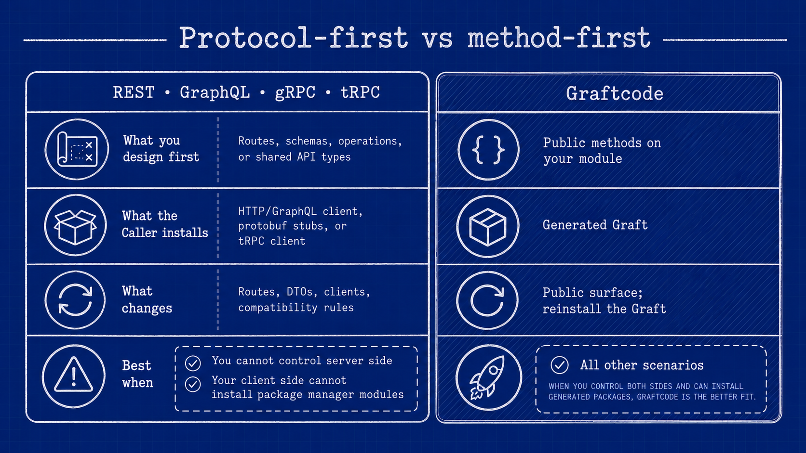
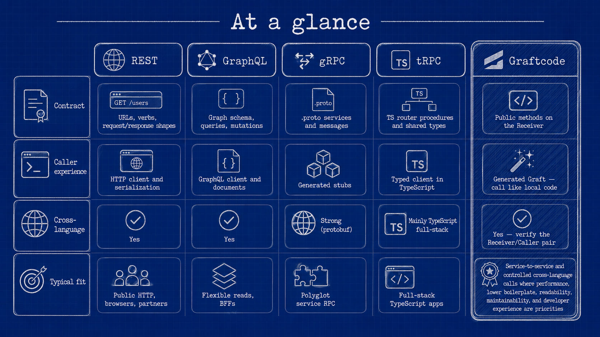

# What is Graftcode?

Graftcode makes public methods callable across languages, processes, and machines —
as if they lived in the same codebase. You write plain business code on one side;
the other side installs a generated package and calls those methods like local
functions. No hand-written REST clients, controllers, or DTOs for the integration.

Two roles matter: the **Receiver** exposes the public methods, and the **Caller**
consumes them through a generated **Graft**. Transport and hosting (including when
execution is remote) are configuration, not code you write by hand. For how Graft,
Gateway, Hypertube, Vision, and Graftcode Engine fit together, see
[How Graftcode works](how-graftcode-works.md).

> **New here?** Run a hands-on course in [Quick start](https://docs.graftcode.com/quick-start)
> first. This documentation explains concepts, procedures, and reference material—it does not replace
> those step-by-step tutorials.

## What Graftcode is for

Graftcode's main goal is to **unify how software communicates and integrates** — regardless of the
technologies involved or the integration scenario. It is not only for service-to-service calls. The
same model covers:

- **Frontend to backend** — a web or mobile frontend calls backend methods directly.
- **Backend to backend** — service-to-service calls across languages.
- **Expose a public API** — expose selected methods to controlled callers.
- **Mix modules in memory** — run modules from different technologies in one process.
- **Expose methods for AI** — every exposed method is also callable as an MCP tool.

It applies the same way to **stateless, stateful, streaming, bi-directional (duplex), and unary**
interactions. In every case the model is the same:

- **On the Receiver (server) side**, integration code is reduced to **plain public methods** — no
  controllers, routes, DTOs, or transport clients.
- **On the Caller (client) side**, you install a **self-updating, strongly typed
  [Graft](../core-concepts/what-is-a-graft.md)** through your normal package manager and call those
  methods like local code. When the Receiver's contract changes, you regenerate and reinstall the
  Graft, so the client stays in sync with the server through a versioned package.

Because the integration method is selected by configuration rather than written into your code, you can
**swap the communication channel** (in-memory, WebSocket, and other transports) without touching
business logic — see [Execution modes](../core-concepts/in-memory-same-machine-and-remote-execution.md).

### Every exposed method is also an MCP tool

Methods you expose through Graftcode are automatically callable over **MCP** as well, so the same
public surface serves both application callers and AI clients without extra integration code. See
[Expose Receiver methods for MCP](../how-to-guides/expose-receiver-methods-for-mcp.md).

## Example: calling a billing method across services

**The problem:** a Node.js application needs `calculateMonthlyBill(unitPrice, units)`, which lives in
a .NET service owned by another team.

### Without Graftcode: controller with routes + hand-written client

**Server side** — the capability is wrapped in an HTTP controller with routes, attributes, and
request/response DTOs:

```multi
```dotnet
// Illustrative REST controller — not Graftcode
[ApiController]
[Route("api/v1/billing")]
public class BillingController : ControllerBase
{
    private readonly BillingService _billing;

    [HttpPost("monthly-bill")]
    public ActionResult<MonthlyBillResponse> CalculateMonthlyBill([FromBody] MonthlyBillRequest request)
    {
        var total = _billing.CalculateMonthlyBill(request.UnitPrice, request.Units);
        return Ok(new MonthlyBillResponse { Total = total });
    }
}

public class MonthlyBillRequest { public decimal UnitPrice { get; set; } public int Units { get; set; } }
public class MonthlyBillResponse { public decimal Total { get; set; } }
```
```javascript
// Illustrative Express controller — not Graftcode
import express from "express";
const app = express();
app.use(express.json());

app.post("/api/v1/billing/monthly-bill", (req, res) => {
  const { unitPrice, units } = req.body;
  const total = billing.calculateMonthlyBill(unitPrice, units);
  res.json({ total });
});
```
```python
# Illustrative FastAPI controller — not Graftcode
from fastapi import FastAPI
from pydantic import BaseModel

app = FastAPI()

class MonthlyBillRequest(BaseModel):
    unit_price: float
    units: int

@app.post("/api/v1/billing/monthly-bill")
def calculate_monthly_bill(request: MonthlyBillRequest):
    total = billing.calculate_monthly_bill(request.unit_price, request.units)
    return {"total": total}
```
```java
// Illustrative Spring controller — not Graftcode
@RestController
@RequestMapping("/api/v1/billing")
public class BillingController {
    private final BillingService billing;

    @PostMapping("/monthly-bill")
    public MonthlyBillResponse calculateMonthlyBill(@RequestBody MonthlyBillRequest request) {
        double total = billing.calculateMonthlyBill(request.getUnitPrice(), request.getUnits());
        return new MonthlyBillResponse(total);
    }
}
```
```php
// Illustrative Laravel controller — not Graftcode
class BillingController extends Controller
{
    public function calculateMonthlyBill(Request $request)
    {
        $total = $this->billing->calculateMonthlyBill(
            $request->input('unitPrice'),
            $request->input('units')
        );
        return response()->json(['total' => $total]);
    }
}
// routes/api.php:
// Route::post('/v1/billing/monthly-bill', [BillingController::class, 'calculateMonthlyBill']);
```
```ruby
# Illustrative Rails controller — not Graftcode
class BillingController < ApplicationController
  def calculate_monthly_bill
    total = Billing.calculate_monthly_bill(params[:unit_price], params[:units])
    render json: { total: total }
  end
end
# config/routes.rb:
# post "/api/v1/billing/monthly-bill", to: "billing#calculate_monthly_bill"
```
```

**Client side** — the caller hand-writes an HTTP client: URL, headers, serialization, and status
handling on every call:

```multi
```dotnet
// Illustrative REST client — not Graftcode
using var http = new HttpClient();
http.DefaultRequestHeaders.Authorization = new("Bearer", token);
var res = await http.PostAsJsonAsync(
    "https://billing.example/api/v1/billing/monthly-bill",
    new { unitPrice = 10, units = 5 });
res.EnsureSuccessStatusCode();
var total = (await res.Content.ReadFromJsonAsync<MonthlyBillResponse>()).Total;
```
```javascript
// Illustrative REST client — not Graftcode
const response = await fetch("https://billing.example/api/v1/billing/monthly-bill", {
  method: "POST",
  headers: { "Content-Type": "application/json", Authorization: `Bearer ${token}` },
  body: JSON.stringify({ unitPrice: 10, units: 5 }),
});
if (!response.ok) throw new Error(`HTTP ${response.status}`);
const { total } = await response.json();
```
```python
# Illustrative REST client — not Graftcode
import requests

res = requests.post(
    "https://billing.example/api/v1/billing/monthly-bill",
    json={"unitPrice": 10, "units": 5},
    headers={"Authorization": f"Bearer {token}"},
)
res.raise_for_status()
total = res.json()["total"]
```
```java
// Illustrative REST client — not Graftcode
HttpClient client = HttpClient.newHttpClient();
HttpRequest request = HttpRequest.newBuilder()
    .uri(URI.create("https://billing.example/api/v1/billing/monthly-bill"))
    .header("Content-Type", "application/json")
    .header("Authorization", "Bearer " + token)
    .POST(HttpRequest.BodyPublishers.ofString("{\"unitPrice\":10,\"units\":5}"))
    .build();
HttpResponse<String> response = client.send(request, HttpResponse.BodyHandlers.ofString());
// parse response.body() for "total"
```
```php
// Illustrative REST client — not Graftcode
$ch = curl_init("https://billing.example/api/v1/billing/monthly-bill");
curl_setopt_array($ch, [
    CURLOPT_POST => true,
    CURLOPT_HTTPHEADER => ["Content-Type: application/json", "Authorization: Bearer $token"],
    CURLOPT_POSTFIELDS => json_encode(["unitPrice" => 10, "units" => 5]),
    CURLOPT_RETURNTRANSFER => true,
]);
$total = json_decode(curl_exec($ch), true)["total"];
```
```ruby
# Illustrative REST client — not Graftcode
require "net/http"
require "json"

uri = URI("https://billing.example/api/v1/billing/monthly-bill")
res = Net::HTTP.post(uri, { unitPrice: 10, units: 5 }.to_json,
                     "Content-Type" => "application/json",
                     "Authorization" => "Bearer #{token}")
total = JSON.parse(res.body)["total"]
```
```

### With Graftcode: clean public method + installed Graft

**Server side (Receiver)** — a plain public method. No controller, route, or DTO plumbing:

```multi
```dotnet
public class BillingService
{
    public decimal CalculateMonthlyBill(decimal unitPrice, int units) => unitPrice * units;
}
```
```javascript
export class BillingService {
  static calculateMonthlyBill(unitPrice, units) {
    return unitPrice * units;
  }
}
```
```python
class BillingService:
    @staticmethod
    def calculate_monthly_bill(unit_price, units):
        return unit_price * units
```
```java
public class BillingService {
    public double calculateMonthlyBill(double unitPrice, int units) {
        return unitPrice * units;
    }
}
```
```php
class BillingService {
    public function calculateMonthlyBill(float $unitPrice, int $units): float {
        return $unitPrice * $units;
    }
}
```
```ruby
class BillingService
  def self.calculate_monthly_bill(unit_price, units)
    unit_price * units
  end
end
```
```

**Client side (Caller)** — install the generated Graft and call the method like local code:

```multi
```dotnet
// Install the Graft; copy package name and host from Vision
GraftConfig.Host = "ws://billing.example/ws"; // before the first call
var billing = new BillingService();
var total = billing.CalculateMonthlyBill(10, 5);
```
```javascript
// Install the Graft; copy package name and host from Vision
import { BillingService } from "<package-from-vision>";
import { GraftConfig } from "<package-from-vision>/config.js";

GraftConfig.host = "ws://billing.example/ws"; // before the first call
const total = BillingService.calculateMonthlyBill(10, 5);
```
```python
# Install the Graft; copy package name and host from Vision
GraftConfig.host = "ws://billing.example/ws"  # before the first call
total = BillingService.calculate_monthly_bill(10, 5)
```
```java
// Install the Graft; copy package name and host from Vision
GraftConfig.setHost("ws://billing.example/ws"); // before the first call
BillingService billing = new BillingService();
double total = billing.calculateMonthlyBill(10, 5);
```
```php
// Install the Graft; copy package name and host from Vision
GraftConfig::$host = "ws://billing.example/ws"; // before the first call
$billing = new BillingService();
$total = $billing->calculateMonthlyBill(10, 5);
```
```ruby
# Install the Graft; copy package name and host from Vision
GraftConfig.host = "ws://billing.example/ws" # before the first call
total = BillingService.calculate_monthly_bill(10, 5)
```
```

**Gateway** hosts the built module, discovers the
[callable surface](../core-concepts/callable-surface.md), and publishes it for
[package generation](../core-concepts/package-generation.md); the Caller installs the resulting Graft.

No hand-written HTTP client, route map, or JSON DTO layer for this internal call—the public method
signature is the contract, and the installed Graft is the client. You still operate a distributed
system (hosts, auth, failures, observability); Graftcode removes the repetitive protocol glue for
callers that can install generated packages.

For a public HTTP API aimed at arbitrary third parties, REST or GraphQL may remain the better
boundary—see [Use Graftcode alongside REST](../how-to-guides/use-graftcode-alongside-an-existing-rest-api.md).

## Why this matters

Reducing integration to public methods on the server and a generated Graft on the client changes how
the whole codebase reads and evolves:

- **Readability** — call sites are ordinary method calls, so code expresses intent instead of
  transport plumbing.
- **Direct model mapping** — public methods map directly to UML class, interaction, and sequence
  diagrams, because there is no protocol layer in between.
- **Simpler PRs and code review** — changes appear as business-logic diffs, not controller, DTO, and
  client boilerplate.
- **Maintainability** — fewer artifacts to keep in sync; a changed public method flows to callers as a
  regenerated package.
- **Channel independence** — business code is fully isolated from the integration method, so you can
  change transport or execution mode by configuration rather than by rewriting code.

### AI-assisted code engineering

The same reduction in code and indirection makes a codebase far friendlier to AI-assisted development.
With no separate protocol layer and much less integration boilerplate, an AI assistant ingests less
code to understand a feature, follows the call graph more directly, and needs fewer iterations and less
context to make a correct change. In practice that means lower token usage, faster refactoring, cheaper
generation and maintenance, and fewer integration mistakes.

## How this differs from REST, GraphQL, gRPC, and tRPC

Most integration stacks start with a **protocol contract** you design and maintain separately from your
business code — OpenAPI routes, GraphQL schemas, `.proto` files, or shared TypeScript router types.
Graftcode starts from **public methods you already write** on a Receiver module. The **Graft** is the
client; callers install it and invoke those methods like local code.

For teams connecting services that can install a package, **Graftcode is significantly better to use**
than protocol-first stacks in day-to-day work. You write and call methods—not routes, GraphQL
documents, `.proto` definitions, or tRPC router wiring. The generated Graft carries transport and
serialization; the same call site works in-memory or remotely when you change `GraftConfig`. Less
boilerplate, fewer artifacts to keep in sync, and a shorter path from a changed public method to a
working cross-language call.

### Protocol-first vs method-first



REST, GraphQL, gRPC, and tRPC are strong choices for **public boundaries** and ecosystems where those
tools are already standard. Graftcode fits **frontend-to-backend, service-to-service, and controlled
internal** callers that should not maintain a hand-written integration layer.

### At a glance



You can keep REST or GraphQL for external clients and add Graftcode for internal integration —
see [Use Graftcode alongside REST](../how-to-guides/use-graftcode-alongside-an-existing-rest-api.md).

A Graft call is still distributed: auth, failures, timeouts, and observability still matter.

### How they compare

For **developer experience and integration speed**, Graftcode is the stronger default when Callers can
install generated packages: you skip the protocol layer that REST, GraphQL, gRPC, and tRPC require you
to design, version, and maintain alongside your business code.


REST and gRPC keep a protocol contract (URLs/operations, schemas, and a client) separate from your
business code. With Graftcode the supported public method surface is the contract and the installed
Graft is the client. For raw throughput, neither approach is universally faster; the right choice
still depends on who owns the contract, who the Callers are, and your interoperability, streaming,
and browser needs. For **how much code you write and how fast you ship internal integration**,
Graftcode is typically the better fit.

Graftcode removes application-authored controllers, DTO mapping, transport clients, and serialization
code for controlled Callers. Its runtime still represents and transfers invocation data, so the
resulting performance depends on the runtime pair, execution mode, payload, transport, topology, and
workload. This documentation does not publish comparative performance numbers without a documented,
reproducible benchmark.

## Where teams use Graftcode

- **Frontend to backend** — call backend methods from a web or mobile frontend.
- **Backend to backend** — service-to-service calls across languages, without hand-written HTTP clients.
- **Expose a public API** — share a Receiver's selected methods with controlled Callers.
- **Mix modules in memory** — run modules from different technologies in one process, then flip to
  remote execution by configuration.
- **Expose methods for AI** — make the same methods callable as MCP tools.

Pick your goal and runtime in [Choose a scenario](choose-your-scenario.md), and review
[current status and limitations](where-does-graftcode-fit.md) before production.

## Next steps

1. [Quick start](https://docs.graftcode.com/quick-start) — first working call for your stack.
2. [How Graftcode works](how-graftcode-works.md) — the How it works diagram and mental model.
3. [Choose a scenario](choose-your-scenario.md) — pick your goal, then your runtime.
4. [Quick reference](../reference/quick-reference.md) — keep open while coding.
