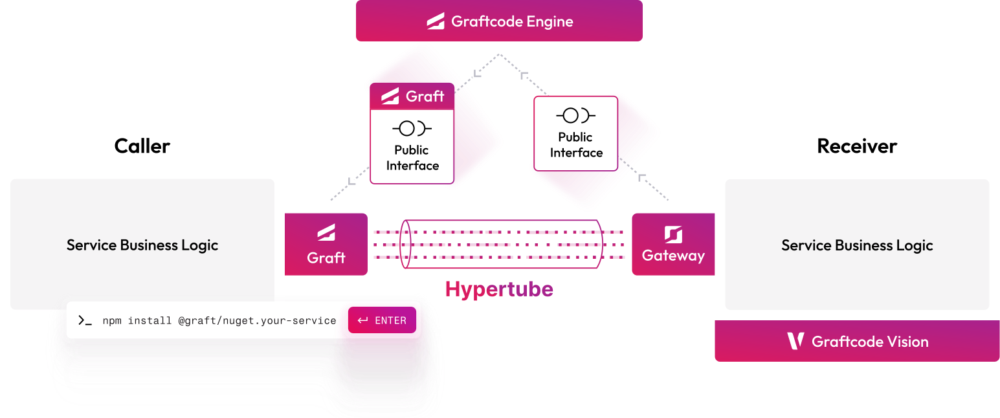
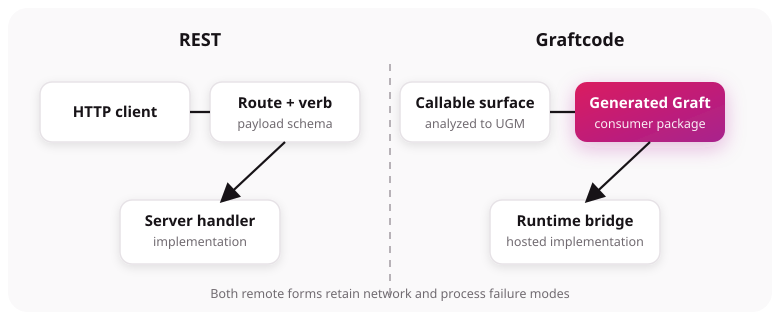

# What is Graftcode?

Graftcode turns a module's public methods into an installable, typed package called a
**[Graft](../core-concepts/what-is-a-graft.md)**. A consumer calls the generated package like ordinary
code; **[Graftcode Gateway](../core-concepts/graftcode-gateway.md)** routes the call to the hosted
module. You write business methods and consumer logic. Graftcode discovers the callable surface,
generates the package, and bridges the runtimes.

> **New here?** Run a hands-on course in [Quick start](https://docs.graftcode.com/quick-start)
> first. This documentation explains concepts, procedures, and reference material—it does not replace
> those step-by-step tutorials.

## Example: calling a billing method across services

**The problem:** a Node.js application needs `calculateMonthlyBill(unitPrice, units)` implemented in
a .NET service on another team.

### Without Graftcode (typical REST or GraphQL integration)

A separate integration layer usually appears between business code and the remote capability:

1. Agree an HTTP or GraphQL contract (OpenAPI, schema, versioning rules).
2. Generate or hand-write a client, DTOs, and error mapping.
3. Build URLs or queries, serialize payloads, and parse responses on every call.
4. Maintain that layer when the contract changes.

```javascript
// Illustrative REST-style consumer code — not Graftcode
const response = await fetch("https://billing.example/api/v1/monthly-bill", {
  method: "POST",
  headers: { "Content-Type": "application/json", Authorization: `Bearer ${token}` },
  body: JSON.stringify({ unitPrice: 10, units: 5 }),
});
if (!response.ok) throw new Error(`HTTP ${response.status}`);
const { total } = await response.json();
```

GraphQL follows the same pattern at the workflow level: schema, client, query documents, and response
mapping—still a protocol integration you maintain beside your domain code.

### With Graftcode

1. The .NET team exposes a plain public method on a class library (the **provider**).
2. **[Graftcode Gateway](../core-concepts/graftcode-gateway.md)** (`gg`) hosts that built module,
   discovers the [callable surface](../core-concepts/callable-surface.md), and publishes it for
   [package generation](../core-concepts/package-generation.md). Gateway is the **runtime host**—not
   the generated npm/NuGet package the consumer installs. See
   [Gateway and hosted modules](../core-concepts/graftcode-gateway.md) and
   [install `gg`](../how-to-guides/run-gateway-locally.md#1-install-gateway).
3. The Node team installs the generated **Graft** (one package) and calls it like local code.

```javascript
// Illustrative Graftcode consumer — copy package name and host from Vision
import { BillingService } from "<package-from-vision>";
import { GraftConfig } from "<package-from-vision>/config.js";

GraftConfig.host = "ws://billing.example/ws"; // before the first call
const total = BillingService.calculateMonthlyBill(10, 5);
```

No hand-written HTTP client, route map, or JSON DTO layer for this internal call—the public method
signature is the contract, and the installed Graft is the client. You still operate a distributed
system (hosts, auth, failures, observability); Graftcode removes the repetitive protocol glue for
**controlled callers** that can install generated packages.

For a public HTTP API aimed at arbitrary third parties, REST or GraphQL may remain the better
boundary—see [Use Graftcode alongside REST](../how-to-guides/coexist-with-rest.md).

## What a successful call looks like

A typical cross-language flow:

1. A **[provider](../core-concepts/callable-surface.md)** exposes a plain public method (for example a
   static `CalculateMonthlyBill` on a .NET class).
2. **[Gateway](../core-concepts/graftcode-gateway.md)** hosts the built module. The host CLI is
   **`gg`** ([install Gateway](../how-to-guides/run-gateway-locally.md#1-install-gateway), then
   `gg ./path/to/module.dll`); it discovers the surface and publishes the model. To run in a
   container, [build your own image](../how-to-guides/deploy-with-docker.md)—there is no official
   pre-built Gateway image.
3. You copy the **complete install command** from that Gateway's
   **[Vision](../core-concepts/graftcode-vision.md)** UI when publishing your own module—or install a
   **public Graft** from `https://grft.dev` when consuming a published package
   ([Obtain and install a Graft](../how-to-guides/obtain-install-graft.md)).
4. The **consumer** installs the generated Graft, sets
   [`GraftConfig` host](../how-to-guides/configure-invocation.md) to the Gateway WebSocket endpoint
   **before the first call**, and invokes the generated method.
5. The result returns as if the remote method were local—still a distributed call under the hood.

Expected outcome for a billing example: `unitPrice * units` computed on the provider and returned to
the caller. Method naming may differ by target language (for example PascalCase on .NET, lower camel
case in generated JavaScript).

## How the pieces fit together



The diagram uses product labels. The same picture in documentation terms:

| On the diagram | In these docs |
| --- | --- |
| **Service business logic** (left) | Your **consumer** application—the [caller](../core-concepts/caller-and-receiver.md). |
| `npm install @graft/...` | Install the generated **[Graft](../core-concepts/what-is-a-graft.md)**—copy the command from [Vision](../core-concepts/graftcode-vision.md) or use a [public package](../how-to-guides/obtain-install-graft.md#install-a-public-graft). |
| **Graft** (left) | The generated package wrappers your consumer imports. |
| **Hypertube** | The [runtime bridge](../core-concepts/hypertube-runtime-bridge.md) inside the Graft—serializes the call, uses `GraftConfig` to pick in-memory or remote execution, and returns the result. |
| **Gateway** (right) | **[Graftcode Gateway](../core-concepts/graftcode-gateway.md)** (`gg`)—hosts the provider module and receives remote invocations. |
| **Service business logic** (right) | Your **provider** module—the [hosted implementation](../core-concepts/graftcode-gateway.md), not the Graft package. |
| **Graftcode Vision** | The Gateway-hosted UI for discovery, install commands, and configuration snippets. |
| **Public interface** | The provider's [callable surface](../core-concepts/callable-surface.md)—public types and methods Gateway analyzes. |
| **Graftcode Engine** | The [package-generation](../core-concepts/package-generation.md) services that turn that surface into installable Grafts. This is **setup time**; normal calls use the installed Graft and Hypertube—they do not regenerate the package. |

**What you write vs what Graftcode generates:**

| You write | Graftcode provides |
| --- | --- |
| Provider library and public methods | Callable-surface analysis, Gateway hosting, and generated Grafts |
| Consumer business logic | Typed Graft wrappers and Hypertube invocation plumbing |
| Runtime host configuration (`GraftConfig`) | Transport selection and remote dispatch |
| Deployment, security, retries, and observability | Vision metadata and package install coordinates |

Text version: `consumer code -> Graft -> Hypertube -> Gateway -> provider method -> result` (after the Graft is installed and configured).

## The call flow

1. Gateway loads the provider module and discovers the supported [callable surface](../core-concepts/callable-surface.md).
2. Gateway publishes that surface for [package generation](../core-concepts/package-generation.md)
   (stored internally as a [UGM](../core-concepts/glossary.md#unified-graft-model-ugm)).
3. The developer copies the exact install command from the live Gateway output or Vision.
4. The consumer installs the generated Graft in the target project.
5. The consumer configures the generated host field before its first call.
6. The generated client serializes an invocation of the provider method.
7. Gateway dispatches the invocation and returns the result.

Package generation is not repeated on every call.

## How this differs from REST and GraphQL



With REST or GraphQL, a team normally maintains a **protocol contract** separate from the provider's
business code: resources or operations, schemas, clients, serialization, and versioning. With
Graftcode, the supported **public programming surface** is the contract and the installed Graft is
the client—so much of the integration scaffolding disappears for callers that can use generated
packages.

| Typical REST / GraphQL integration | Graftcode (internal / controlled callers) |
| --- | --- |
| Design URLs, verbs, or GraphQL operations | Expose public methods on a module |
| OpenAPI / GraphQL schema and codegen (or manual client) | Install one generated Graft package |
| Per-call request building and response parsing | Typed method call in the consumer language |
| Contract drift between spec and implementation | Callable surface analyzed from the provider |
| Often natural for public, browser, and partner APIs | Strong fit for service-to-service and cross-language modules |

**What you stop writing (in the common case):** HTTP client wrappers, route constants, request/response
DTOs mapped only for transport, and glue that turns exceptions into status codes for internal callers.

**What you still own:** provider business logic, Gateway deployment, `GraftConfig` / host configuration,
authentication, retries, monitoring, and compatibility across language and type boundaries.

This is a difference in developer workflow, not a claim that networks disappear. Remote Graft calls
still cross a transport, can fail, require compatible contract types, and need authentication,
authorization, observability, timeouts, retries, and deployment controls appropriate to the system.
REST and GraphQL remain useful for public protocol-oriented APIs, webhooks, broad third-party
interoperability, and clients that cannot install a generated Graft. Many products use both—see
[Use Graftcode alongside REST](../how-to-guides/coexist-with-rest.md).

## Boundaries

- Graftcode does not replace business logic, infrastructure, deployment, security, or monitoring.
- Public contracts must use types supported by the complete provider-to-consumer generation path.
- Current .NET public methods must be synchronous; keep `Task`, framework types, streams, HTTP
  abstractions, and cancellation tokens out of the public surface.
- Prefer static stateless methods for remote work. Stateful instances require affinity and have a
  lifecycle across calls.
- `Host` defaults to in-memory execution. Set the generated host field before the first remote call.
- A free Gateway registry ID is dynamic. A project key is required when stable project identity is
  needed.
- Generated output and Vision from the running Gateway are authoritative for package names, imports,
  versions, and configuration snippets.

## Next steps

1. [Quick start](https://docs.graftcode.com/quick-start) — first working call for your stack.
2. [The five-minute mental model](what-problem-does-graftcode-solve.md).
3. [What is a Graft?](../core-concepts/what-is-a-graft.md).
4. [Quick reference](../reference/quick-reference.md) — keep open while coding.
5. [Choose a scenario](when-to-use-graftcode.md) — Quick start links for your integration goal.
6. [Current limitations](where-graftcode-fits.md) before production use.
