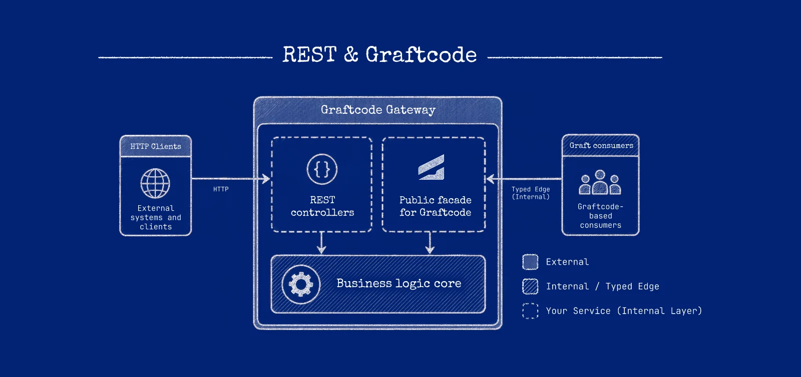

# What is Graftcode?

Graftcode turns a module's public methods into an installable, typed package called a
**[Graft](../core-concepts/what-is-a-graft.md)**. A Caller calls the generated package like ordinary
code; **[Graftcode Gateway](../core-concepts/graftcode-gateway.md)** routes the call to the hosted
module. You write business methods and Caller logic. Graftcode discovers the callable surface,
generates the package, and bridges the runtimes.

> **New here?** Run a hands-on course in [Quick start](https://docs.graftcode.com/quick-start)
> first. This documentation explains concepts, procedures, and reference material—it does not replace
> those step-by-step tutorials.

## Example: calling a billing method across services

**The problem:** a Node.js application needs `calculateMonthlyBill(unitPrice, units)`, which lives in
a .NET service owned by another team.

### Without Graftcode (typical REST or GraphQL integration)

A separate integration layer usually appears between business code and the remote capability:

1. Agree an HTTP or GraphQL contract (OpenAPI, schema, versioning rules).
2. Generate or hand-write a client, DTOs, and error mapping.
3. Build URLs or queries, serialize payloads, and parse responses on every call.
4. Maintain that layer when the contract changes.

```javascript
// Illustrative REST-style Caller code — not Graftcode
const response = await fetch("https://billing.example/api/v1/monthly-bill", {
  method: "POST",
  headers: { "Content-Type": "application/json", Authorization: `Bearer ${token}` },
  body: JSON.stringify({ unitPrice: 10, units: 5 }),
});
if (!response.ok) throw new Error(`HTTP ${response.status}`);
const { total } = await response.json();
```

GraphQL follows the same pattern at the workflow level: schema, client, query documents, and response
mapping—still a protocol integration you maintain beside your domain code.

### With Graftcode

1. The .NET team exposes a plain public method on a class library (the **Receiver**).
2. **[Graftcode Gateway](../core-concepts/graftcode-gateway.md)** (`gg`) hosts that built module,
   discovers the [callable surface](../core-concepts/callable-surface.md), and publishes it for
   [package generation](../core-concepts/package-generation.md). Gateway is the **runtime host**—not
   the generated npm/NuGet package the Caller installs. See
   [Gateway and hosted modules](../core-concepts/graftcode-gateway.md) and
   [install `gg`](../how-to-guides/run-gateway-locally.md#1-install-gateway).
3. The Node team installs the generated **Graft** (one package) and calls it like local code.

```javascript
// Illustrative Graftcode Caller — copy package name and host from Vision
import { BillingService } from "<package-from-vision>";
import { GraftConfig } from "<package-from-vision>/config.js";

GraftConfig.host = "ws://billing.example/ws"; // before the first call
const total = BillingService.calculateMonthlyBill(10, 5);
```

No hand-written HTTP client, route map, or JSON DTO layer for this internal call—the public method
signature is the contract, and the installed Graft is the client. You still operate a distributed
system (hosts, auth, failures, observability); Graftcode removes the repetitive protocol glue for
**controlled callers** that can install generated packages.

For a public HTTP API aimed at arbitrary third parties, REST or GraphQL may remain the better
boundary—see [Use Graftcode alongside REST](../how-to-guides/coexist-with-rest.md).

For the step-by-step build → host → install → call sequence, see
[How Graftcode works](what-problem-does-graftcode-solve.md).

## How the pieces fit together


The diagram uses product labels. The same picture in documentation terms:

| On the diagram | In these docs |
| --- | --- |
| **Service business logic** (left) | Your **Caller** application—the [caller](../core-concepts/caller-and-receiver.md). |
| `npm install @graft/...` | Install the generated **[Graft](../core-concepts/what-is-a-graft.md)**—copy the command from [Vision](../core-concepts/graftcode-vision.md) or use a [public package](../how-to-guides/obtain-install-graft.md#install-a-public-graft). |
| **Graft** (left) | The generated package wrappers your Caller imports. |
| **Hypertube** | The [runtime bridge](../core-concepts/hypertube-runtime-bridge.md) inside the Graft—serializes the call, uses `GraftConfig` to pick in-memory or remote execution, and returns the result. |
| **Gateway** (right) | **[Graftcode Gateway](../core-concepts/graftcode-gateway.md)** (`gg`)—hosts the Receiver module and receives remote invocations. |
| **Service business logic** (right) | Your **Receiver** module—the [hosted implementation](../core-concepts/graftcode-gateway.md), not the Graft package. |
| **Graftcode Vision** | The Gateway-hosted UI for discovery, install commands, and configuration snippets. |
| **Public interface** | The Receiver's [callable surface](../core-concepts/callable-surface.md)—public types and methods Gateway analyzes. |
| **Graftcode Engine** | Analyzes the surface and [generates](../core-concepts/package-generation.md) the installable Graft. This is **setup time**; normal calls use the installed Graft and Hypertube—they do not regenerate the package. |

**What you write vs what Graftcode generates:**

| You write | Graftcode provides |
| --- | --- |
| Receiver library and public methods | Callable-surface analysis, Gateway hosting, and generated Grafts |
| Caller business logic | Typed Graft wrappers and Hypertube invocation plumbing |
| Runtime host configuration (`GraftConfig`) | Transport selection and remote dispatch |
| Deployment, security, retries, and observability | Vision metadata and package install coordinates |

Text version: `Caller code -> Graft -> Hypertube -> Gateway -> Receiver method -> result` (after the Graft is installed and configured).

## How this differs from REST and GraphQL



With REST or GraphQL you maintain a **protocol contract** (URLs/operations, schemas, clients,
serialization, versioning) separate from your business code. With Graftcode the supported **public
method surface** is the contract and the installed Graft is the client, so that scaffolding
disappears for callers that can install generated packages. It is still a distributed call — auth,
failures, timeouts, and observability still matter. REST and GraphQL remain the better fit for public,
browser, and partner APIs; many products use both. See
[Use Graftcode alongside REST](../how-to-guides/coexist-with-rest.md).

## Where teams use Graftcode

- Service-to-service calls across languages, without hand-written HTTP clients.
- Sharing a Receiver library with internal or controlled Callers.
- Flipping the same code between in-memory and remote execution by configuration.
- Exposing Receiver methods as MCP tools.

Pick your goal and runtime in [Choose a scenario](when-to-use-graftcode.md), and review
[current status and limitations](where-graftcode-fits.md) before production.

## Next steps

1. [Quick start](https://docs.graftcode.com/quick-start) — first working call for your stack.
2. [How Graftcode works](what-problem-does-graftcode-solve.md) — the core mental model.
3. [Choose a scenario](when-to-use-graftcode.md) — pick your goal, then your runtime.
4. [Quick reference](../reference/quick-reference.md) — keep open while coding.
