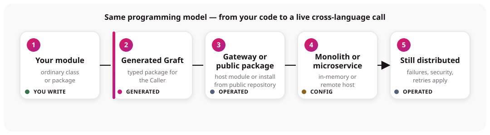

# How Graftcode works

Graftcode reduces the separate integration layer that normally sits between a callable business
method and its consumer. It does not make a distributed call local; it makes the consumer-facing
programming model look like an installed dependency.

## Five things to remember

1. **The module is your code.** A provider is an ordinary class library or module. Its intentional,
   supported public methods form the [callable surface](../core-concepts/callable-surface.md).
2. **The Graft is generated code.** It is a package for the consumer's package manager and language.
   It mirrors the provider surface; it is not the provider implementation. See
   [What is a Graft?](../core-concepts/what-is-a-graft.md).
3. **Gateway hosts and analyzes modules.** It loads the provider, exposes runtime transports, serves
   [Vision](../core-concepts/graftcode-vision.md), and publishes the model used to generate packages.
   Install `gg` from [Gateway releases](https://github.com/grft-dev/graftcode-gateway/releases) or
   [build a container image](../how-to-guides/deploy-with-docker.md). Details:
   [Gateway and hosted modules](../core-concepts/graftcode-gateway.md).
4. **Configuration selects execution.** A generated client can resolve in-memory or remote
   execution. Remote calls must [configure the Gateway host](../how-to-guides/configure-invocation.md)
   before the first invocation.
5. **A method call is still distributed.** Serialization, routing, failures, compatibility,
   security, retries, and observability still matter.

## Build time versus call time

During setup, Gateway analyzes the provider and the package system generates a language-specific
Graft. During normal runtime invocation, the already-installed Graft sends the call through its
resolved execution path. It does not regenerate the package.

## The contract

The contract is the supported public surface: declaring types, methods, parameters, return values,
and public model members. Public does not automatically mean portable. The whole path—Graftcode
Engine generation and runtime execution—must support every exposed type.

Keep transport, database, framework, and implementation types private or internal. For the safest
cross-language surface, use simple primitives, strings, and plain models, then test the exact
provider/consumer pair.

## A useful distinction

- **Written:** provider logic, consumer logic, runtime configuration, operational policy.
- **Generated:** Graft package, language bindings, contract metadata, Vision views.
- **Operated:** Gateway process, transports, package access, deployment, security, telemetry.

That distinction prevents two common mistakes: treating Gateway as the generated client, or treating
the generated client as if it removes remote-system failure modes.

## Continue

- [Quick start](https://docs.graftcode.com/quick-start) — hands-on tutorials for your stack.
- [What is Graftcode?](what-is-graftcode.md#example-calling-a-billing-method-across-services) — REST vs Graftcode example.
- Read [caller and receiver](../core-concepts/caller-and-receiver.md).
- Read [invocation lifecycle](../core-concepts/invocation-lifecycle.md).
- [Choose a scenario](when-to-use-graftcode.md).
