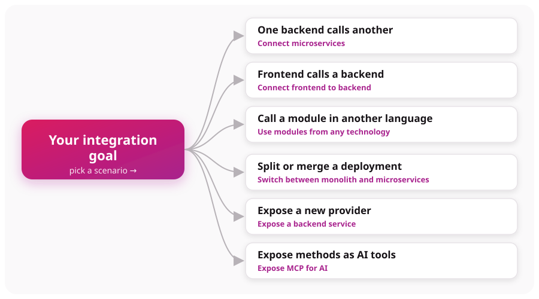

# Choose your scenario

Use this page to route from your goal to a [Quick start](https://docs.graftcode.com/quick-start)
course and the documentation that explains the design behind it. Graftcode is best suited to callable
behavior with an intentional programming interface; it is not a universal replacement for every
protocol or data movement pattern.

> **Hands-on first:** Quick start has step-by-step tutorials. Return here and to the reference
> pages when you need concepts, constraints, or operations detail. See the full course index in
> [Quick start courses](../reference/quick-start-courses.md).

## Start with your goal

Most tasks map to one of four goals. Pick yours, then choose your runtime in the matching section
below:

1. **Expose a new Receiver** — make a module callable → [Expose a backend service](https://docs.graftcode.com/quick-start/expose-backend)
2. **One backend calls another** — service-to-service → [Connect microservices](https://docs.graftcode.com/quick-start/connect-microservices)
3. **A frontend calls a backend** → [Connect frontend to backend](https://docs.graftcode.com/quick-start/connect-frontend-to-backend)
4. **Call a module in another language** → [Use modules from any technology](https://docs.graftcode.com/quick-start/use-modules-from-any-technology)

Less common goals: [switch between monolith and microservices](https://docs.graftcode.com/quick-start/switch-between-monolith-and-microservices) · [expose methods as AI tools](https://docs.graftcode.com/quick-start/expose-mcp).

The sections below add the runtime-specific links and the concepts to read for each goal.

## I want one backend to call another

**Quick start:** [Connect microservices](https://docs.graftcode.com/quick-start/connect-microservices)
— by Caller runtime:

- [.NET](https://docs.graftcode.com/quick-start/connect-microservices/dotnet)
- [JavaScript](https://docs.graftcode.com/quick-start/connect-microservices/javascript)
- [Python](https://docs.graftcode.com/quick-start/connect-microservices/python)
- [Java](https://docs.graftcode.com/quick-start/connect-microservices/java)
- [Kotlin](https://docs.graftcode.com/quick-start/connect-microservices/kotlin)
- [Groovy](https://docs.graftcode.com/quick-start/connect-microservices/groovy)

**Then read:** [Caller and receiver](../core-concepts/caller-and-receiver.md),
[Configure invocation](../how-to-guides/configure-invocation.md).

Good fit when Callers can install generated packages and you want typed method calls across
process or language boundaries.

## I want browser, desktop, or mobile code to call a backend

**Quick start:** [Connect frontend to backend](https://docs.graftcode.com/quick-start/connect-frontend-to-backend)
— by framework:

- [React](https://docs.graftcode.com/quick-start/connect-frontend-to-backend/react)
- [Vue](https://docs.graftcode.com/quick-start/connect-frontend-to-backend/vue)
- [Angular](https://docs.graftcode.com/quick-start/connect-frontend-to-backend/angular)

**Then read:** [Supported runtimes and package managers](../reference/supported-runtimes-package-managers.md)
and [Authenticate Graft calls](../how-to-guides/authenticate-graft-calls.md).

Verify browser transport, bundler, authentication, and supported-type constraints for the exact
generated Graft.

## I want to call a module written in another language

**Quick start:** [Use modules from any technology](https://docs.graftcode.com/quick-start/use-modules-from-any-technology)
— by Caller runtime:

- [.NET](https://docs.graftcode.com/quick-start/use-modules-from-any-technology/dotnet)
- [JavaScript](https://docs.graftcode.com/quick-start/use-modules-from-any-technology/javascript)
- [Java](https://docs.graftcode.com/quick-start/use-modules-from-any-technology/java)
- [Kotlin](https://docs.graftcode.com/quick-start/use-modules-from-any-technology/kotlin)
- [Groovy](https://docs.graftcode.com/quick-start/use-modules-from-any-technology/groovy)

**Then read:** [Type mapping](../core-concepts/type-mapping.md) and
[Supported runtimes and package managers](../reference/supported-runtimes-package-managers.md).

## I want to split or merge a deployment without rewriting callers

**Quick start:** [Switch between monolith and microservices](https://docs.graftcode.com/quick-start/switch-between-monolith-and-microservices)
— by runtime:

- [.NET](https://docs.graftcode.com/quick-start/switch-between-monolith-and-microservices/dotnet)
- [JavaScript](https://docs.graftcode.com/quick-start/switch-between-monolith-and-microservices/javascript)
- [Java](https://docs.graftcode.com/quick-start/switch-between-monolith-and-microservices/java)
- [Kotlin](https://docs.graftcode.com/quick-start/switch-between-monolith-and-microservices/kotlin)
- [Groovy](https://docs.graftcode.com/quick-start/switch-between-monolith-and-microservices/groovy)

**Then read:** [Execution modes](../core-concepts/execution-modes.md),
[Configuration resolution](../core-concepts/configuration-resolution.md), and
[Invocation lifecycle](../core-concepts/invocation-lifecycle.md).

The Caller programming surface can remain similar while configuration selects in-memory or remote
execution. Deployment changes still require compatible packages and runtime configuration.

## I want to expose a new Receiver

**Quick start:** [Expose a backend service](https://docs.graftcode.com/quick-start/expose-backend)
— by Receiver runtime:

- [.NET](https://docs.graftcode.com/quick-start/expose-backend/dotnet)
- [JavaScript](https://docs.graftcode.com/quick-start/expose-backend/javascript)
- [Python](https://docs.graftcode.com/quick-start/expose-backend/python)
- [Java](https://docs.graftcode.com/quick-start/expose-backend/java)
- [Kotlin](https://docs.graftcode.com/quick-start/expose-backend/kotlin)
- [Groovy](https://docs.graftcode.com/quick-start/expose-backend/groovy)

**Then read:** [Expose code](../how-to-guides/expose-code.md),
[Obtain and install a Graft](../how-to-guides/obtain-install-graft.md).

## I want to expose methods as AI tools

**Quick start:** [Expose MCP for AI](https://docs.graftcode.com/quick-start/expose-mcp) — by runtime:

- [.NET](https://docs.graftcode.com/quick-start/expose-mcp/dotnet)
- [JavaScript](https://docs.graftcode.com/quick-start/expose-mcp/javascript)
- [Python](https://docs.graftcode.com/quick-start/expose-mcp/python)
- [Java](https://docs.graftcode.com/quick-start/expose-mcp/java)
- [Kotlin](https://docs.graftcode.com/quick-start/expose-mcp/kotlin)
- [Groovy](https://docs.graftcode.com/quick-start/expose-mcp/groovy)

**Then read:** [Expose methods for MCP](../how-to-guides/expose-mcp.md),
[Graftcode Gateway](../core-concepts/graftcode-gateway.md), and
[Known limitations](../reference/known-limitations.md).

Keep the public surface small and treat tool authorization, input validation, and data exposure as
explicit design work.

## I am designing a production contract

**Documentation-first:** [Callable surface](../core-concepts/callable-surface.md),
[type mapping](../core-concepts/type-mapping.md), and
[Contract evolution](../core-concepts/contract-evolution.md).

Generate and smoke-test the exact Receiver/Caller pair before depending on advanced types.

## Keep another integration style when

- external Callers require a public, protocol-defined HTTP API;
- a third party supports only REST, webhooks, gRPC, or another fixed protocol;
- the interaction is event streaming, queueing, bulk transfer, or one-way data exchange rather than
  method invocation;
- Callers cannot install or run a supported generated package;
- a simple stable local function or direct library reference already solves the problem.

These approaches can coexist with Graftcode. Choose per boundary, not per organization.

## Before production

Review [current status and limitations](where-graftcode-fits.md),
[supported runtimes and package managers](../reference/supported-runtimes-package-managers.md),
[authentication and authorization](../operations/authentication-authorization.md), and
[scaling](../operations/scaling.md).
