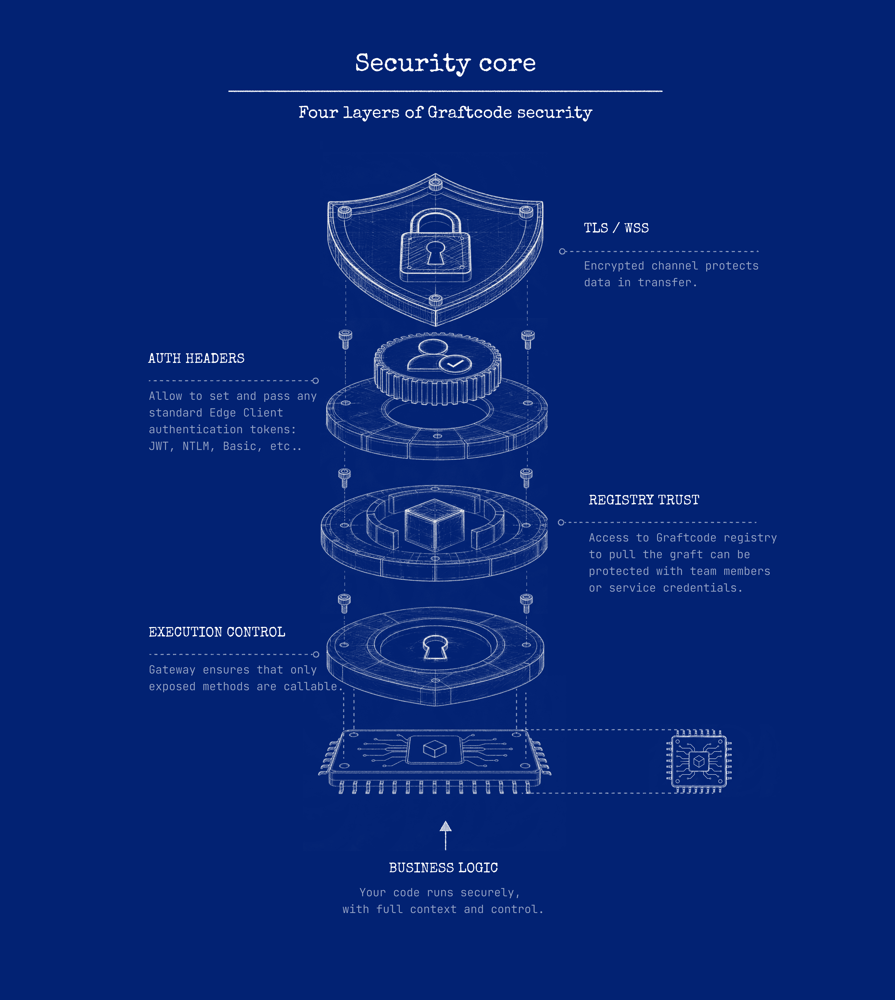

# Authentication and authorization operations

Four security concerns are separate and must not be conflated (see the canonical
[Project Key, registry, host, and credentials](../reference/identifiers-and-auth.md)):

1. **Transport encryption** — TLS/WSS on the network hop.
2. **Invocation authentication and authorization** — proving and checking the identity behind a call.
3. **Registry/package access** — who can install a generated Graft.
4. **Callable-surface execution control** — which methods Gateway will accept at all.



Receiver business logic remains in the Receiver-controlled environment. During a normal invocation,
runtime payloads travel from the Caller through the configured transport to Gateway and the Receiver;
they do not pass through Graftcode Engine (see the canonical
[data boundary](../core-concepts/graftcode-gateway.md#data-boundary)). The **Project Key** associates
Gateway with a project; it is **not** proof that a runtime call is authorized.

## Recommended approach (current release)

1. **Terminate TLS/WSS at reviewed ingress or a reverse proxy** in front of Gateway. Use `wss://` (or
   `https`-based transports) from the Caller to that endpoint.
2. **Authenticate each invocation** by passing a token or API key as a supported method parameter, or
   through the generated header helpers, and **validate it in the Receiver before any business effect**.
3. **Authorize in the Receiver's business boundary** (method-level checks), default deny, and keep
   policy independent of transport.
4. **Restrict registry/package access** so only intended Callers can install the Graft.

Pass a token as a supported method parameter when you need the most portable path (it works in every
runtime and in browser Callers). Use generated header helpers when a per-call header fits better:

Example header configuration (copy exact API names from Vision):

```multi
```dotnet
GraftConfig.Host = "wss://service.example/ws";
GraftConfig.Stateless = true;
GraftConfig.SetHeaders(new Dictionary<string, string> {
    ["Authorization"] = "Bearer <token>"
});
```
```javascript
GraftConfig.host = "wss://service.example/ws";
GraftConfig.stateless = true;
GraftConfig.setHeaders({ Authorization: "Bearer <token>" });
```
```python
GraftConfig.host = "wss://service.example/ws"
GraftConfig.stateless = True
# Copy header helper names from Vision.
```
```java
GraftConfig.host = "wss://service.example/ws";
GraftConfig.stateless = true;
GraftConfig.setHeaders(java.util.Map.of("Authorization", "Bearer <token>"));
```
```php
GraftConfig::$host = 'wss://service.example/ws';
GraftConfig::$stateless = true;
GraftConfig::setHeaders(['Authorization' => 'Bearer <token>']);
```
```ruby
GraftConfig.host = "wss://service.example/ws"
GraftConfig.stateless = true
# Copy header helper names from the generated gem.
```
```

Default deny at the Receiver boundary, log authorization decisions without credentials, and keep
policy logic independent from transport. Never place a full token in an exception message or log line,
and keep `GG_DEBUG` off outside controlled diagnosis (it can log invocation data).

## Multi-user Callers: prefer per-invocation identity

`GraftConfig` header configuration is process-wide. In a multi-user application, do not store one
user's token in shared static configuration. Instead, pass the caller's identity as a per-invocation
method parameter (or a per-call header where supported) so each call carries the correct identity, and
authorize it in the Receiver.

## TLS and WSS

TLS/WSS is encrypted **across the configured hop**. When TLS terminates at ingress or a reverse proxy,
the hop from there to Gateway is a separate connection and may be unencrypted unless you configure it;
do not describe this as end-to-end encryption. Gateway does not provide native certificate
configuration, so terminate and manage TLS at reviewed infrastructure. Browser WebSocket handshakes
cannot set arbitrary custom headers; use only the HTTP/2 configuration emitted by Vision when a
header-based workflow is required in the browser.

**Status:** Passing a token as a method parameter is **Available** in every runtime. A JWT security
plugin is **Alpha/Preview**; its packaging, configuration, and cross-runtime support are not yet a
generally available feature, and automatic credential propagation must not be assumed.

## Next steps

- [Authenticate Graft calls](../how-to-guides/authenticate-graft-calls.md)
- [Networking and ports](networking-ports.md)
- [Known limitations](../reference/known-limitations.md)
