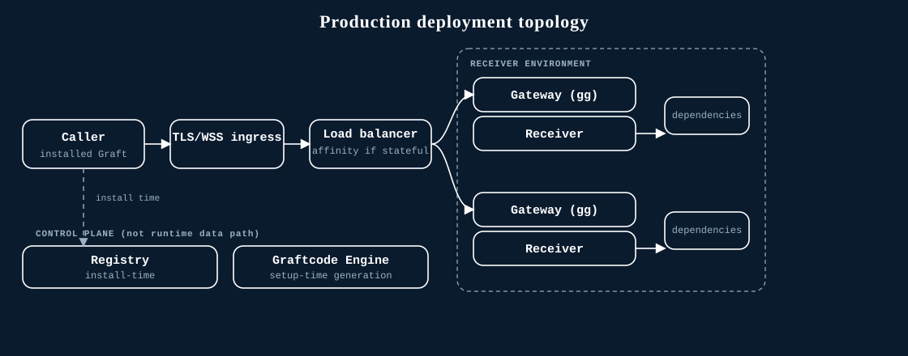

# Scaling Gateway Receivers

*Production topology: stateless calls fan out across replicas; stateful calls stay pinned by
connection affinity. The registry and Graftcode Engine are control-plane services, not part of the
runtime data path.*

## Stateless Receivers

Static, stateless methods are the safest scaling unit. Run identical Gateway/Receiver instances
behind infrastructure that supports the selected transport. Route each independent call to any ready
instance.

Keep module, Gateway, generated-package, and configuration versions aligned across the pool. Remove an
instance from readiness before stopping it.

## Stateful Receivers

Instance methods and complex remote objects can retain identity on one receiver. Keep the connection
and session on the same Gateway instance with WebSocket-aware affinity. Scale-in or restart can
invalidate that identity; callers must recreate state or fail clearly.

## Capacity

Measure Receiver duration, concurrent connections, CPU, memory, dependency limits, and error rates.
Scale on observed saturation rather than assuming one call maps to one lightweight request.

## Publication identity

Use one reviewed project identity strategy. A project key gives stable project-backed registry
addressing, but it does not replace load balancing or runtime-call authorization.

Graftcode does not provide a built-in autoscaling formula, connection-drain API, distributed
object-state store, or transparent state migration. Test infrastructure compatibility for WebSocket,
and for optional TCP or HTTP/2 traffic, in your own environment.

## Next steps

- [Networking and ports](networking-ports.md)
- [Health checks](health-checks.md)
- [Version compatibility and upgrades](version-compatibility-upgrades.md)
