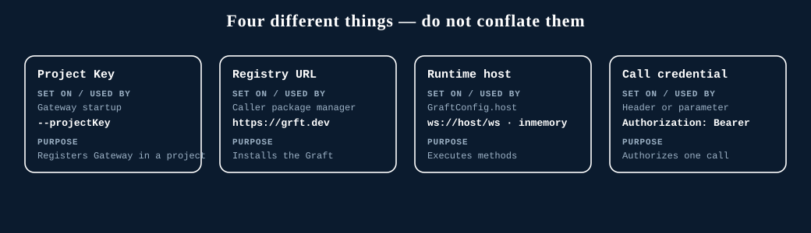

# Project Key, registry, host, and credentials

Four Graftcode concepts are easy to confuse. They are **separate** and serve different purposes:

> **Project Key** registers the Gateway in a project. The **registry URL** installs the Graft. The
> **runtime host** executes methods. The **call credential** authorizes a specific call.

## The canonical table

| Concept | Set on / used by | Purpose | Example |
| --- | --- | --- | --- |
| **Project Key** | Gateway at startup (`--projectKey`, `GC_PROJECT_KEY`) | Registers the Gateway in a portal project; gives stable publication identity | `dev:eyJ...` |
| **Registry URL** | Caller package manager | Installs the generated Graft package | `https://grft.dev` |
| **Runtime host** | `GraftConfig` host field | Executes methods — in-memory or a remote Gateway endpoint | `ws://host/ws`, `wss://host/ws`, `inmemory` |
| **Call credential** | A method parameter or a generated header | Authorizes one specific invocation | `Authorization: Bearer <token>` |

## What each is not

- The **Project Key** is **not** a registry URL and **not** proof that a runtime call is authorized.
- The **registry URL** is only for installation; it is **not** the runtime endpoint.
- **`GraftConfig` host is the runtime endpoint for executing calls — it is never the registry URL.**
- A **call credential** is validated by your Receiver; it is **not** replaced by the Project Key or TLS.

## Where to go next

- [Use a portal project key](../how-to-guides/project-key.md)
- [Obtain and install a Graft](../how-to-guides/obtain-install-graft.md)
- [Configure invocation](../how-to-guides/configure-invocation.md)
- [Authenticate Graft calls](../how-to-guides/authenticate-graft-calls.md)
- [Authentication and authorization](../operations/authentication-authorization.md)
